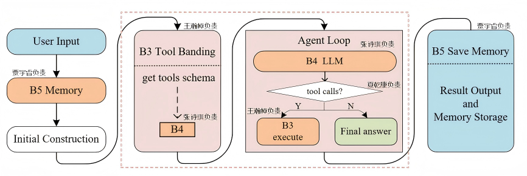
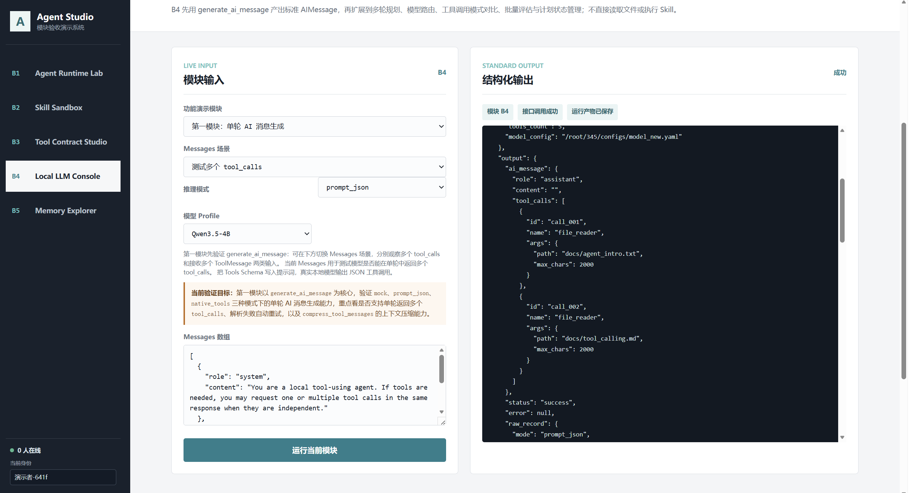
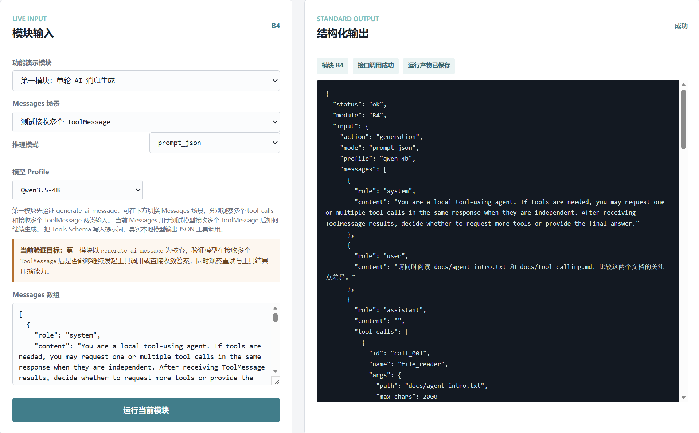
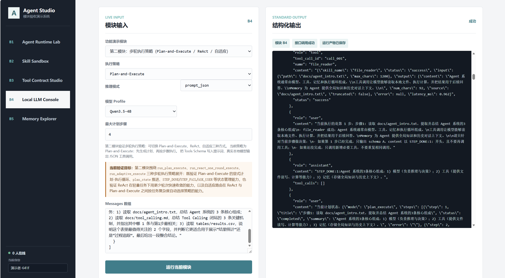
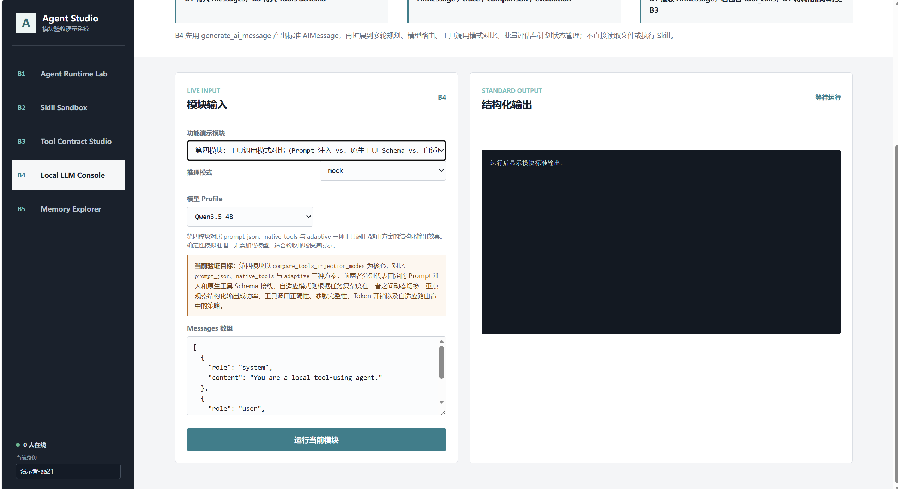
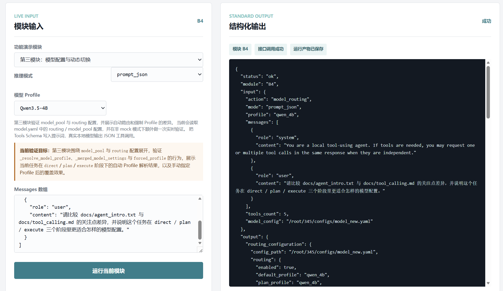
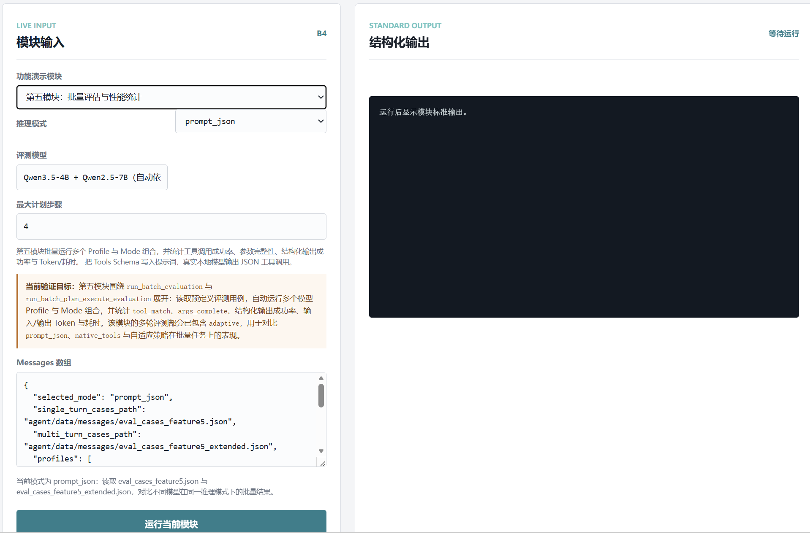

# 综合实训Ⅱ阶段 - 个人结题技术报告

---

## 一、 项目与团队基本信息

*   **本人姓名**：张诗琪
*   **本人学号**：20236517
*   **项目名称**：Agent Studio：本地文件驱动的工具增强型 Agent 系统
*   **实际完成目标**：完成全部 5 项进阶功能（F1 多工具并行调用、F2 Plan-and-Execute 多步规划、F3 本地模型切换、F4 双模式对比、F5 批量评估框架）并进行 6 项扩展增强（E1 工具结果压缩、E2 证据充分性校验、E3 Reflexion 重规划、E4 Human-in-the-Loop、E5 自适应路由、E6 工具结果缓存），以及整体前端双系统（Agent Studio Web + Module Studio b4部分）
*   **小组其他成员**：王瀚樟、夏乾康、贾宇睿

### 成员最终分工与交付核对表
> *请在下表中加粗本人所在行，以便验收老师快速定位。*

| 角色 | 姓名 | 学号 | 实际负责的核心模块名称 | 个人代码库链接 | 
| :---: | :---: | :---: | :---: | :---: | 
| 组长 | 王瀚樟 | 20236472 | 模块B1/B3（如：多轮对话核心路由与Agent规划） | [Link](https://github.com/ciel796/personal-B1B3) | 
| **组员** | **张诗琪** | **20236517** | **B4 Agent LLM 决策模块 + 整体前端实现** | **[Link](https://github.com/Lily4059/b4-LLM)** |
| 组员 | 夏乾康 | 20236527 | 模块B2（如：外部Skill工具调用增强） | [Link](https://github.com/kkkIsComing/agent713_b2) | 
| 组员 | 贾宇睿 | 20236457 | 模块B5（如：外部Skill工具调用增强） | [Link](https://github.com/kaliumyr/agent-studio-b5/) | 

---

## 二、整体系统架构与最终成果展示

### 2.1 最终系统总体架构图



系统以 B1 Agent Runtime 为总调度层，将 B2 Skill、B3 Tool Layer、B4 Local LLM 和 B5 Memory 组织为可循环执行的本地 Agent。架构图中的主要数据流如下：

1. 用户输入首先与 B5 返回的全局/对话记忆一起构造初始 messages。
2. B1（王瀚樟负责） 从 B3（王瀚樟负责） 获取当前 toolset 的 Tools Schema，再将 messages 和 Schema 交给 B4。
3. B4（张诗琪负责） 使用本地 Qwen3.5-4B 生成 AIMessage，决定直接回答还是调用工具。
4. 若 AIMessage 包含 `tool_calls`，B1 转交 B3 校验与执行，B3 调用 B2 Skill 并返回带 `tool_call_id` 的 ToolMessage。
5. B1 将 AIMessage 和 ToolMessage 追加到消息历史，再次调用 B4，直到得到最终答案或达到最大工具轮次。
6. 任务结束后，B1 落盘 messages、trace、checkpoint 和 final answer，并按配置调用 B5（贾宇睿负责） 保存记忆。

### 2.2 系统整体运行流程与集成说明

用户可通过 Agent Studio Web 选择普通对话、单轮工具、Plan-and-Execute 或智能执行模式。Web 后端将页面参数整理为 Runtime JSON 后调用 B1。B1 根据当前状态在 `need_user`、`need_llm` 和 `need_tools` 三类动作之间转换，完成对话、模型决策、工具执行和结果输出。

完整运行流程可表示为：

```text
用户 / Web
  -> B1 读取 Runtime 输入
  -> B5 加载相关记忆
  -> B3 生成 Tools Schema
  -> B4 生成 AIMessage
  -> B1 判断 tool_calls
       -> 有：B3 校验与执行 B2 Skill -> ToolMessage -> 回到 B4
       -> 无：输出 final_answer
  -> B1 保存 messages / trace / checkpoint
  -> B5 可选保存会话或全局记忆
```

模块集成时的核心是统一三类数据契约：

* `AIMessage`：B4 返回的最终文本或 `tool_calls`。
* `SkillResult`：B2（夏乾康负责） Skill 的输入、输出、状态、错误和耗时。
* `ToolMessage`：B3 将 SkillResult 与原 ToolCall ID 关联后返回 B1 的标准消息。

联调中重点处理了两类问题。第一类是模块间 JSON 字段不一致，通过统一 `role/content/tool_calls/tool_call_id/status` 等字段解决；第二类是文件路径和运行环境不同，通过相对配置路径、规范化 `data_root` 与 fixture/mock 模式保证 Windows 本地与 Linux 服务器都能独立验证。

### 2.3 最终产品展示（Demo）

* [智能执行演示视频](images/intelligent_execution_demo.mp4)
* [Plan-and-Execute 演示视频](images/plan_and_execute_demo.mp4)

两个演示分别对应自适应任务执行和显式规划后执行的系统入口。

### 2.4 团队系统代码库

   **团队 Github/Gitee 开源仓库链接**：[[Link](https://github.com/ciel796/Agent-Studio-team)]

---

## 三、 个人核心模块技术报告

### 3.1 模块定位与系统融合方式

*   **在系统中的角色**：

    本人负责两大核心交付物：**B4 Agent LLM 决策模块** 和 **整体前端实现**。

    **B4 模块**是整个 Agent 系统的"决策大脑"。在每轮 Agent Loop 中，B1 Runtime 将构造好的完整消息序列（messages）和 B3 生成的工具说明（tools_schema）交给 B4，B4 调用本地 Qwen3.5-4B 模型，根据当前上下文判定下一步动作——是直接生成最终回答，还是请求调用一个或多个工具。没有 B4，系统将失去"判断何时需要工具、选择哪个工具、如何组织回答"的核心智能能力，各模块将无法形成闭环。B4 的设计遵循一个核心原则：**推理与执行解耦**。B4 不直接读文件、不直接执行工具，只做一件事——接收上下文，调用本地 LLM，输出"下一步该调用什么工具"的结构化指令（AIMessage）。这种解耦让 B4 可以独立测试，只要给它 messages 和 tools_schema 就能验证推理结果，不需要真正执行任何工具。

    **整体前端**（Agent Studio Web + Module Studio）是系统面向用户和验收老师的唯一交互入口。Agent Studio Web 提供对话、工具管理、记忆管理、模型配置、执行追踪和评估分析六个页面，将 B1—B5 的完整运行结果以可视化方式呈现；Module Studio 在单页面中独立展示各模块的输入输出与接口关系，为逐模块验收提供统一界面。

*   **上下游依赖与接口协同**：

    | 方向 | 对接模块 | 数据格式 | 说明 |
    |---|---|---|---|
    | 上游输入 | B1 Agent Runtime | `messages: list[dict]`（含 system/user/assistant/tool 角色） | B1 构造完整消息序列，传入 B4 |
    | 上游输入 | B3 Tool Layer（经 B1 转发） | `tools_schema: list[dict]`（OpenAI 风格工具说明） | B3 生成工具 Schema，B1 转发给 B4 |
    | 上游输入 | B1 Agent Runtime | `model_config: str`（YAML 路径）、`mode: str`（推理模式） | B1 指定模型配置和推理模式 |
    | 下游输出 | B1 Agent Runtime | `AIMessage: {"role": "assistant", "content": "...", "tool_calls": [...]}` | B4 将标准 AIMessage 返回给 B1，B1 判断是否含 tool_calls |
    | 下游产物 | 文件系统 | `raw_model_output.json`、`ai_message.json`、`llm_run_log.jsonl` | B4 保存每次调用的原始输出和解析结果 |
    | 前端入口 | 浏览器 | HTTP GET/POST → `ai_web/server.py` → 调用 B1 → B1 调用 B4 | Agent Studio Web 的对话 API 间接调用 B4 |
    | 前端演示 | 浏览器 | HTTP POST → `module_demos/demo_server.py` → 直接调用 B4 | Module Studio 的 B4 页面直接调用 `generate_ai_message` |

    以一次典型对话为例，前端（本人负责）调用 `POST /api/chat`，服务端调用 B1 run_agent，B1 在每轮循环中调用 `b4_local_agent_llm.generate_ai_message(model_config, messages, tools_schema, mode, artifact_dir)`，B4 返回标准 AIMessage。前端将 AIMessage 和工具调用过程实时渲染为对话气泡和执行步骤列表。

### 3.2 核心技术实现路径

*   **算法与工程实现**：

    本人负责的 B4 模块基于以下开源技术栈构建：

    **深度学习框架**：**PyTorch 2.7.1** 作为底层张量计算和 GPU 加速框架，提供 `torch.bfloat16` 混合精度推理和 `device_map` 自动设备分配能力。**Transformers 5.12.1**（HuggingFace）提供模型加载、tokenizer 序列化、chat_template 工具注入（`apply_chat_template(tools=...)`）和文本生成 pipeline（`AutoModelForCausalLM` + `AutoTokenizer`）。**Python 3.12** 标准库提供 JSON 解析（`json.JSONDecoder.raw_decode` 用于容错解析）、正则匹配（`re` 模块用于启发式分类和文本标记提取）、深拷贝（`copy.deepcopy` 用于 plan_state 状态隔离）和哈希缓存（`hashlib` 用于模型缓存 key 生成）。

    **核心模型**：主推理模型为 **Qwen3.5-4B-Instruct**（约 40 亿参数，支持 32K 上下文窗口），对比验证模型为 **Qwen2.5-7B-Instruct**（约 70 亿参数）。两种模型均采用 `bfloat16` 精度加载至 `cuda:0`，通过 `model.eval()` 和 `torch.no_grad()` 确保推理阶段无梯度计算，降低显存占用。

    **参考范式与算法**：
    - **Plan-and-Execute**：参考 HuggingGPT（Shen et al., 2023）的"先规划后执行"范式，将复杂任务拆解为规划阶段（生成结构化步骤列表）→ 执行阶段（逐步调用工具）→ 状态管理阶段（四种文本标记驱动步骤流转）的三阶段架构。
    - **ReAct（Reasoning + Acting）**：Yao et al. (2022) 提出的"推理-行动"交替范式，作为单步任务的基准执行模式（`react_one_round`），模型在单轮内交替输出思考过程和工具调用。
    - **Reflexion（Self-Reflective Agents）**：Shinn et al. (2023) 的自我反思机制，应用于 E3 扩展——工具调用失败后，模型被引导完成"诊断原因 → 比较候选 → 选择动作"的三步结构化修复循环，而非简单重试。
    - **Human-in-the-Loop**：借鉴交互式 AI 系统中的人机协同理念，在 Agent 遇到预算耗尽、资源歧义等无法自主解决的困境时暂停执行，将决策权通过结构化 A/B/C 选项交还给人类用户。
    - **自适应路由（Adaptive Routing）**：受 Mixture-of-Experts 路由机制的启发，设计三级路由决策（启发式快速分类 → LLM 细分类 → 策略选择），根据任务复杂度动态切换 ReAct 单轮与 Plan-and-Execute 多步策略。

    整个模块约 4910 行 Python 代码，实现了以下核心能力：

    本节聚焦两大核心实现：**Plan-and-Execute 多步规划及其延伸出来的自适应路由**，以及 **Human-in-the-Loop 辅助功能**。这两个能力构成了 B4 模块最复杂的工程挑战。代码中 6 项扩展增强（E1-E6）全部因我在实际开发和评测中遇到具体问题后才设计并实现的。

    ---

    #### 一、Plan-and-Execute 多步规划（F2）及其自适应路由（E5）

    **1. 设计动机与问题来源**

    基础版 B4 只支持单轮 ReAct 模式：用户提问 → B4 生成 tool_calls → B3 执行 → B4 生成最终回答。这种模式对"计算 123+456"或"读取 a.txt"这类单步任务足够，但面对"搜索 docs 目录下与预算相关的文件，读取前 3 个，对比它们的共同点和差异"这类多步骤任务时，4B 小模型在单轮内无法同时完成搜索、多文件读取和对比分析——它的上下文窗口有限，工具调用的输出会迅速撑满输入，导致后续推理质量急剧下降。

    我参考了 HuggingGPT 的 Plan-and-Execute 范式，设计了"先规划后执行"的三阶段架构：**规划阶段**（LLM 输出结构化步骤列表）→ **执行阶段**（逐步注入 plan_state 上下文，LLM 逐步调用工具）→ **状态管理阶段**（四种文本标记驱动步骤流转）。这一架构将一个复杂的多步骤任务拆解为多次独立的、上下文更短的单步推理，大幅提升了小模型的执行成功率。

    **2. 规划阶段：结构化计划生成**

    在 `_run_plan_execute_impl` 函数（L3854）的入口处，我构造了一段 `planning_instruction` 追加到用户消息末尾，明确指示模型：
    - 本轮不要调用任何工具（tool_calls 必须是 []）
    - 按严格 JSON 输出计划，content 必须是 JSON 对象或数组
    - 计划应保持执行导向，优先给出能完成任务的最短可行步骤
    - 若后续执行中发现计划有冗余或遗漏，可通过 PLAN_UPDATE 做自我修正

    模型返回的计划 JSON 经 `parse_json_object_from_text` 提取后，传入 `normalize_plan_steps` 函数进行标准化：为每个步骤分配递增编号（step）、保留标题（title）、初始化状态为 pending。如果模型未能输出有效计划（JSON 解析失败或为空），则调用 `fallback_plan_steps` 根据用户输入文本和步骤数上限生成兜底计划。

    规划阶段的 prompt 设计中有一个关键细节：我告诉模型"不必追求僵硬的一次定稿"并明确提到了 PLAN_UPDATE 机制。这是因为在评测中我发现，4B 模型在第一轮规划时经常遗漏步骤或拆分粒度不当，如果强制要求一次性生成完美计划，反而会降低成功率。允许后续自我修正使系统对规划质量的要求降低了，整体鲁棒性反而提高。

    **3. 执行阶段：四状态标记驱动的步骤流转**

    规划完成后，进入执行循环。在正式进入循环之前，系统先做两个预处理：一是调用 `build_plan_execute_instruction(plan_state)` 将当前完整的计划状态（每一步的编号、标题、状态）格式化为一段结构化文本注入 messages，让模型在每轮推理时都能看到全局进度；二是判断是否可以走**单步快速路径**——当计划只有 1 步且该步骤不需要外部工具证据时（`_step_requires_external_evidence` 返回 False），系统直接将所有步骤标记为 completed 并注入"请直接输出最终回答"的指令，跳过整个执行循环。这一优化让"计算 123+456"这类任务在 Plan-and-Execute 模式下也不会浪费额外的工具调用轮次。

    执行循环的核心是一个 `while True` 主循环（L4061），由 `max_llm_calls = 1 + max_plan_steps * 3 + max_turns * 2` 计算总上限来防止无限循环。循环内部每轮的处理流程是：调用 `generate_ai_message` 获取 AIMessage → 检查是否有 tool_calls → 如果有，匹配目标步骤 → 执行工具 → 收集证据 → 处理状态标记 → 注入下一步指令 → 继续循环。当所有步骤状态变为 completed 时，循环退出，进入最终回答阶段。

    核心状态机由 `apply_step_marker` 函数（L1505）实现，支持四种文本标记：

    | 标记 | 格式 | 作用 | 触发后续行为 |
    |---|---|---|---|
    | **STEP_DONE** | `STEP_DONE:<步骤号>:<摘要>` | 标记当前步骤完成 | 推进到下一步 pending 步骤；若所有步骤完成则进入最终回答阶段 |
    | **STEP_FAIL** | `STEP_FAIL:<步骤号>:<原因>` | 标记当前步骤失败 | 优先处理失败步骤；触发 Reflexion 重规划（E3） |
    | **PLAN_UPDATE** | `PLAN_UPDATE:<新计划JSON>` | 替换后续未完成计划 | 保留已完成步骤，用新计划替换 pending/failed 步骤，重新编号 |
    | **ASK_USER** | `ASK_USER:<问题文本>` | 暂停等待用户决策 | 设置 status="needs_user"，终止循环，返回问题给前端 |

    `apply_step_marker` 的实现采用正则匹配：首先尝试匹配 `PLAN_UPDATE`，解析其中的新计划 JSON 后，将已完成步骤（status=="completed"）保留原样，pending/failed 步骤用新计划替换，并统一重新编号。然后尝试匹配 `STEP_DONE` 和 `STEP_FAIL`，直接修改对应步骤的 status、summary 和 error 字段。如果三种标记都不匹配，返回 (plan_state, None) 表示无状态变更。

    **4. 步骤与工具调用的自动匹配**

    在 Plan-and-Execute 的执行循环中，一个关键难题是：模型输出的 tool_calls 需要自动关联到对应的计划步骤。例如，当计划第 2 步是"读取 budget_2024.csv 和 budget_2025.csv"时，模型可能输出两个 file_reader 的 tool_calls，系统需要知道这两个调用属于第 2 步而非第 3 步。

    我通过 `_match_plan_step_for_tool_calls` 函数（L1478）实现了基于评分的自动匹配算法。该函数从所有 pending 和 failed 状态的步骤中，找到与当前 tool_calls 最匹配的步骤。评分规则（`_step_match_score`，L1454）综合考虑三个维度：
    - **工具名匹配**：工具名出现在步骤标题中（+3 分），特定工具名-标题关键词组合（如 table_analyzer + "csv"）额外加分（+4 分）
    - **文件路径匹配**：tool_calls 中的 path/root_dir 参数出现在步骤标题中（+4 分），文件名 stem 匹配（+1 分）
    - **失败步骤优先**：如果步骤状态为 failed，额外 +1 分，确保重试优先路由到之前失败的步骤

    此外，我还实现了 `_deterministic_plan_tool_calls` 函数（L1622），用于对包含"搜索"关键词的步骤直接生成确定性工具调用（local_file_search），跳过 LLM 推理，加速第一步搜索类操作的执行。这一"快速路径"机制在评测中显著减少了搜索步骤的 LLM 调用次数和耗时。

    **4.1 步骤-工具匹配的执行流程**

    在执行循环中，当模型返回的 AIMessage 包含 tool_calls 时，系统并不是直接执行，而是经过一个完整的三步处理链：

    **第一步：步骤标记预处理**。如果 AIMessage 中同时出现了 `_step_marker`（如 STEP_DONE:2:...）和 tool_calls，系统先调用 `_should_defer_step_done_marker`（L1989）判断是否需要延迟标记处理。延迟的条件是：标记是 STEP_DONE 类型、且当前步骤的证据不足。这种情况下，系统先不处理标记，等工具执行完毕收集到新证据后再校验。如果标记是 STEP_FAIL，则不延迟，立即处理失败状态。

    **第二步：目标步骤定位**。通过 `_match_plan_step_for_tool_calls` 找到 tool_calls 应该归属的计划步骤。如果匹配不到任何 pending/failed 步骤（返回 None），系统还会尝试 `_infer_target_step_from_tool_calls` 做推断——当推断出的步骤状态为 failed 时，自动将其重置为 pending 并清空 error 字段，使重试能自然进行。

    **第三步：工具调用执行与结果收集**。通过 E6 缓存机制（见下文）检查 tool_calls 是否命中缓存，未命中的才实际调用 B3/B2 执行。执行成功后，将结果写入缓存。然后调用 `summarize_tool_round_for_step` 生成本轮工具执行摘要，通过 `merge_tool_messages` 合并多条 ToolMessage 为一条，再通过 `_propagate_step_evidence` 将证据传播到其他可能受益的步骤。每轮结束后，调用 `_persist_runtime_state` 将完整运行时状态（messages、plan_state、trace、evidence）持久化到磁盘，确保任何时刻中断都不会丢失上下文。

    **5. 证据充分性校验（E2）：防止"幻觉式跳步"**

    这是 Plan-and-Execute 开发中遇到的第一个严重问题，也是所有扩展中优先级最高的一个。具体表现为：模型在执行第 2 步"读取 a.txt 和 b.txt 并对比"时，经常直接输出 `STEP_DONE:2:已读取两个文件并完成对比`，但实际上根本没有调用 file_reader——它"幻觉"了工具调用过程。

    这一问题在基础版 Plan-and-Execute 中频繁出现，导致评测用例中"对比两个文件"类任务的工具匹配率只有 60% 左右。我意识到必须在模型输出 STEP_DONE 与实际状态变更之间建立一道**硬验证防线**。

    `_has_sufficient_evidence` 函数（L1872）根据步骤标题中的关键词匹配对应工具的成功结果：
    - **搜索类步骤**（标题含"搜索/search/查找/检索"）：需要 local_file_search 成功
    - **文件对比步骤**（标题含"对比/比较/差异/共同点"）：需要至少 2 个不同 file_reader 成功（通过 `_distinct_successful_file_sources` 从证据列表提取所有成功 file_reader 的不同 source 路径）
    - **文件读取步骤**（标题含"读取/read/阅读/检查"）：需要至少 `_required_distinct_file_count` 返回的数量个不同文件成功读取。该函数支持中文数字解析（"两篇"→2、"三个文件"→3），也支持从阿拉伯数字提取
    - **表格分析步骤**（标题含"csv/tsv/table/表格"）：需要 table_analyzer 成功
    - **存在性检查步骤**（标题含"是否存在"）：特殊处理——所有 file_reader 都返回"文件不存在"也算成功，通过 `_is_missing_file_error` 判断错误消息是否为 "file not found" 类错误

    evidence_policy 分 strict/lite 两档：strict 模式下所有类型的证据都必须满足；lite 模式下 calculator、format_converter 等内部工具跳过校验。

    证据校验的拦截逻辑在执行循环中多处触发：
    - 模型输出 STEP_DONE 时，`_should_defer_step_done_marker`（L1989）先检查当前步骤是否有足够证据。如果证据不足但模型同时发出了 tool_calls（可能标记和调用同时出现），则延迟标记处理，等工具执行完再校验
    - 如果模型输出 STEP_DONE 但完全没有对应步骤的工具证据，系统将步骤状态重置回 pending，并注入一条强制提示："不能将第 X 步标记为完成，因为当前没有足够的真实工具证据支撑"
    - 如果模型输出自由文本（无标记、无 tool_calls），系统检查当前目标步骤是否有足够证据：有则自动推断为 STEP_DONE；无则阻止直接用自然语言完成，要求模型先调用工具

    引入 E2 后，"对比两个文件"类任务的工具匹配率从约 60% 提升到了 95%+，是整个系统中单个扩展带来的最大提升。

    **6. 工具结果压缩（E1）：防止上下文溢出**

    Plan-and-Execute 的多步骤执行导致 messages 列表不断增长。一个典型的 4 步任务，每步涉及 1-2 次工具调用，加上计划状态注入和工具结果回灌，messages 长度很容易超过模型的上下文窗口限制（Qwen3.5-4B 为 32K tokens）。这是 E1 功能诞生的直接原因。

    `compress_tool_messages` 函数（L686）按工具类型定制压缩策略，配置参数从 `model.yaml` 的 `enhancement.tool_result_compression` 节读取。函数首先通过 `_read_enhancement_config` 读取配置，检查 `enabled` 开关（默认开启）。如果压缩被禁用，直接原样返回 tool_messages。开启时，遍历所有 role="tool" 的消息，对每条消息调用 `_extract_tool_result` 提取工具结果，再调用 `_compress_skill_result` 根据工具名选择对应的压缩策略。

    四种压缩策略的实现细节：

    - **file_reader（`_compress_file_reader_output`，L600）**：先检查 content 是否超过 `max_content_chars`（默认 900，通过 `_clamp_int` 限制在 120-5000 范围内）。如果内容较短，直接原样返回。如果内容已经是编号列表格式（非空行以 "1. "/"2. "/"3. " 开头），也跳过压缩——因为编号列表通常是模型已经整理过的结构化输出，二次压缩会破坏格式。否则，调用 `_three_points` 函数（L724）提取前 3 个要点：按段落或句号分割文本，去重后取前 3 段，不足 3 条时补 "工具结果未提供更多可提取内容"。提取的 3 个要点被格式化为 "1. xxx\n2. xxx\n3. xxx" 后，再传入 `_compress_text` 做头尾截断。

    - **local_file_search（`_compress_local_file_search_output`，L627）**：限制 `max_search_results`（默认 6，范围 1-20）和 `max_snippet_chars`（默认 260，范围 80-800）。遍历搜索结果列表，只保留前 max_results 条，对每条结果的 snippet 调用 `_compress_text` 截断。更新后的结果列表会记录 `original_result_count` 和 `compressed` 标志。

    - **table_analyzer（`_compress_table_analyzer_output`，L654）**：只压缩 `preview` 字段，限制 `max_preview_rows`（默认 6，范围 1-20）。保留 `original_preview_rows` 用于调试。表格的其他字段（如列头、统计摘要）不受影响。

    - **其他工具（通用 `_compress_text`，L583）**：采用 "70% 头部 + 尾部保留 + 中间省略号" 的策略。具体计算：`head_chars = max(60, int(max_chars * 0.7))`，`tail_chars = max(40, max_chars - head_chars - 20)`，中间用 "\n...\n" 连接。`_clamp_int` 确保参数在合理范围内。

    压缩完成后，`_compress_skill_result` 将压缩后的 output 写回 skill_result，并在 output 中附加 `truncated`、`compressed`、`original_num_chars` 等元数据字段。`compress_tool_messages` 将更新后的结果重新序列化为 JSON 写入 message 的 content 字段，同时返回 `compression_meta`（含 `compressed_messages` 计数），记录在 trace 中供调试。实测中，4 步任务的 messages 总长度经压缩后可减少 40-60%，有效避免了上下文溢出导致的生成质量下降。

    **7. Reflexion 重规划（E3）：结构化错误修复**

    工具调用失败后的简单重试无效——文件路径错了用同样错误路径重试还是失败。这是 E3 功能诞生的原因。

    `_replan_hint_from_tool_failures` 函数（L1404）的实现细节：首先调用 `merge_tool_messages` 合并所有 tool_messages（因为同一轮可能有多个工具调用，合并后便于统一处理），然后遍历合并后的结果，筛选出 status != "success" 的失败项。对每个失败项，提取 `name`（优先从 message 的 name 字段获取，否则从 result 的 skill_name 获取）、`input`（result 中的 input 字典）和 `error`（result 中的 error 字典），组装成 `{"name": ..., "input": ..., "error": ...}` 的三元组列表。如果没有失败项，函数直接返回空字符串，不注入任何提示。

    如果有失败项，函数将三元组列表序列化为 JSON，生成一段结构化的 Reflexion 提示注入 messages。该提示包含三个层次：

    第一层是**结构化错误信息**：将失败三元组以 JSON 格式呈现给模型，让模型看到"什么工具、用了什么参数、为什么失败"。这种结构化的错误反馈比自然语言描述更精确，模型可以直接解析 JSON 中的字段来做修复决策。

    第二层是**修复策略引导**：提示明确要求模型"在内部完成一次'诊断→候选→选择动作'的自我修复，不要把完整思维过程写出来"。具体约束是：1）在内部判断 1~3 个最可能的失败原因；2）在内部比较 1~2 个替代动作，**优先最小改动，不要重复已经成功的工具调用**；3）只输出选择的那个动作。"不要重复已经成功的工具调用"这条约束很关键——它防止模型在重试时盲目重复之前已经成功的操作，浪费工具预算。

    第三层是**出口选择**：模型可以选择三种输出——schema B 请求新 tool_calls（有明确可重试方案时）、schema A 以 ASK_USER 开头列出候选与需要用户确认的信息（存在多个候选且无法判断时）、schema A 以 STEP_FAIL 开头说明原因与替代方案（无法在预算内完成时）。提示最后还强调"不要在 content 中夹带 tool_calls，也不要输出 role 标签或多余文本"，防止模型混淆 schema A 和 schema B 的输出格式。

    此外，`_is_missing_file_error` 函数（L1399）实现了对"文件不存在"错误的特判：将错误消息转为小写后，检查是否包含 "file not found:"、"table file not found:" 或 "not found:" 子串。当步骤标题含"是否存在"且所有 file_reader 都返回 file not found 错误时，系统不触发 Reflexion 重试，而是直接将步骤标记为 completed 并记录"已确认目标文件不存在"。这避免了在文件确实不存在的场景下陷入无意义的重试循环——这是一个在评测中多次踩坑后才加入的兜底逻辑。

    **8. 工具结果缓存（E6）：两层去重机制**

    在多步骤执行中，不同步骤可能请求读取同一个文件。例如，第 1 步"搜索相关文件"找到了 a.txt，第 2 步"读取前 3 个文件"又请求读取 a.txt。如果每次都实际调用 B3/B2，既浪费时间又浪费工具预算。这是 E6 功能诞生的原因。

    E6 实现了两层去重机制，两层在实际执行中的调用顺序是先缓存后去重：

    **第一层（跨步骤缓存）**：在 `_run_plan_execute_impl` 中维护一个局部字典 `tool_result_cache`（L4057）。在每轮工具执行前，系统遍历当前 AIMessage 中的所有 tool_calls，对每个调用先调用 `_normalize_tool_call_args_for_execution` 规范化参数（例如对 table_analyzer 的 CSV 路径做前缀补全），然后用 `name + "|" + json.dumps(args, ensure_ascii=False, sort_keys=True)` 生成缓存 key。key 中的 args 经过 `sort_keys=True` 排序，确保参数顺序不同但内容相同的调用能命中同一缓存项。

    查缓存时，如果 `tool_result_cache.get(cache_key)` 返回字典（命中），系统直接构造一条 ToolMessage：role="tool"、tool_call_id 取自原始调用的 id、name 为工具名、status="success"、content 为缓存结果序列化后的 JSON 字符串。这条 ToolMessage 不经过 B3/B2 执行，完全不消耗工具预算。未命中的调用被收集到 `pending_tool_calls` 列表中，等待实际执行。缓存命中数和未命中数分别记录在 turn 的 `tool_cache_hits` 字段和 `tool_round_dir` 中。

    缓存写入发生在工具实际执行成功之后：遍历本轮执行返回的 tool_messages，对每条 status == "success" 的消息，调用 `_extract_tool_result` 提取 result，再用 `skill_name + "|" + json.dumps(input, ensure_ascii=False, sort_keys=True)` 生成 key，将完整 result 写入 `tool_result_cache`。失败的结果不写入缓存——这是有意的设计，因为失败可能是临时性的（如网络超时），缓存失败结果会阻止后续正确的重试。

    **第二层（发出前去重）**：`_dedupe_identical_resource_tool_calls` 函数在 tool_calls 实际交给 B3 执行之前，基于 `(name, resource_path)` 二元组签名去重。对于 file_reader 和 table_analyzer，resource_path 提取自 args 中的 path 参数；对于 local_file_search，提取 query 和 root_dir。签名相同的调用只保留第一个，其余丢弃。这一层去重主要处理同一轮内模型输出了重复 tool_calls 的情况（例如模型同时请求两次读取 a.txt），而第一层缓存主要处理跨轮次/跨步骤的重复。

    两层机制的配合效果：第一层消除了跨步骤的重复执行（如先搜索再读取同一个文件），第二层消除了同一轮内的重复请求。在评测中，E6 的缓存命中率约为 15-25%，虽然数字不高，但在长任务链中累积节省的工具调用次数和 Token 消耗非常可观。

    **9. 证据传播与步骤提前完成**

    `_propagate_step_evidence` 函数（L2134）实现了一个巧妙的优化：当一个步骤的工具执行结果恰好也满足另一个 pending 步骤的证据需求时，自动将证据传播过去。例如，第 1 步"读取 a.txt 和 b.txt"执行完后，如果第 3 步"对比 a.txt 和 c.txt"只需要一个 a.txt 的证据，那么第 3 步的证据需求中 a.txt 部分已被满足，传播记录在 trace 的 `evidence_propagated_to_steps` 字段中。

    **10. 自适应路由（E5）：Plan-and-Execute 的智能入口**

    Plan-and-Execute 虽然对多步任务有效，但对"计算 123+456"这类单步任务来说，先生成计划再执行是浪费——额外的 LLM 调用和更长的响应时间。我需要一个机制来判断任务复杂度，自动选择 ReAct 单轮还是 Plan-and-Execute。这就是自适应路由（E5）。

    `run_adaptive_execute` 函数（L3798）是自适应路由的入口，其核心是 `classify_task_complexity` 函数（L3408）。该函数实现了**三级路由决策**：

    **第一级：启发式快速分类**。`_heuristic_task_complexity` 函数基于正则匹配用户输入文本，返回 complexity（low/high）和 confidence：
    - 纯算术表达式（匹配 `\d+[\+\-\*\/\%\^]\d+`）：low，置信度 0.95
    - 单步文件读取（匹配一个文件路径且无"对比/比较/差异"等关键词）：low，置信度 0.85
    - 含"搜索/查找/检索/对比/比较/差异/汇总"等多步关键词：high，置信度 0.70

    **第二级：LLM 细分类**。如果启发式的置信度不足以做出高置信决策（当前实现中启发式结果始终参与，LLM 分类器作为验证和修正），则调用 `classify_task_complexity`。该函数构造一段 routing_instruction 追加到用户消息末尾，要求模型输出 `{"complexity": "low"/"high", "confidence": 0.0-1.0, "reason": "..."}` 格式的分类结果。注意这里调用 `generate_ai_message` 时 tools_schema 传空列表，因为分类任务不需要工具。如果 LLM 分类器调用失败（status != "success"）、意外返回了 tool_calls、或解析结果无效，则自动回退到启发式分类结果。

    **第三级：策略选择**。根据最终分类结果，low 走 `_run_react_one_round_execute_impl`（单轮执行，max_tool_rounds=1），high 走 `_run_plan_execute_impl`（多步规划）。路由决策写入 `routing.json` 保存。

    实测效果（adaptive 模式 vs 纯 Plan-and-Execute 模式）：adaptive 模式下 22 条扩展评测用例的输入 Token 从 16,676 降至 9,311（节省 44%），耗时从 44.68s 降至 29.67s（缩短 33%），成功率维持在 77.27%，综合效率最优。

    下图展示了 E5 自适应路由的三级决策架构：

    ```mermaid
    %%{init: {'theme': 'base', 'themeVariables': { 'primaryColor': '#e8f5f1', 'primaryTextColor': '#0d7a5f', 'primaryBorderColor': '#0d7a5f'}}}%%
    flowchart TB
        classDef startNode fill:#e8f0f8,stroke:#3b5998,stroke-width:2px,color:#3b5998,font-weight:600
        classDef decisionNode fill:#fff8e8,stroke:#b5651d,stroke-width:2px,color:#b5651d,stroke-dasharray: 5 5,font-weight:600
        classDef processNode fill:#e8f5f1,stroke:#0d7a5f,stroke-width:2px,color:#0d7a5f,font-weight:600
        classDef endNode fill:#f0e8f8,stroke:#8e44ad,stroke-width:2px,color:#8e44ad,font-weight:600
        classDef extNode fill:#fdf6ec,stroke:#b5651d,stroke-width:2px,color:#b5651d,font-weight:600

        U["用户输入"] --> H["第一级：启发式快速分类<br/>正则匹配输入文本"]
        H --> D1{"置信度 ≥ 阈值？"}
        D1 -->|是| P["策略选择"]
        D1 -->|否| L["第二级：LLM 细分类<br/>调用模型输出 JSON"]
        L --> D2{"解析有效且<br/>无 tool_calls？"}
        D2 -->|是| P
        D2 -->|否| R["回退到启发式结果"]
        R --> P
        P --> D3{"分类结果"}
        D3 -->|low| REACT["ReAct 单轮执行<br/>max_tool_rounds=1"]
        D3 -->|high| PE["Plan-and-Execute<br/>多步规划执行"]

        class U startNode
        class H,L processNode
        class D1,D2,D3 decisionNode
        class P processNode
        class R extNode
        class REACT,PE endNode
    ```

    ---

    #### 二、Human-in-the-Loop（E4）：人机协同决策

    **1. 设计动机与问题来源**

    在 Plan-and-Execute 的实际运行中，我发现 Agent 经常陷入"死循环"或做出"无意义重试"：工具预算耗尽后仍然尝试调用工具、用户输入中包含了同一文件的重复引用、或者当前信息不足以继续但模型不知道该问什么。这些场景下，继续让模型自主决策只会浪费资源。E4 的核心设计理念是：**当 Agent 遇到自身无法解决的困境时，暂停执行并将决策权交给人类用户**。

    **2. 四种触发场景**

    Human-in-the-Loop 在以下四种场景下被触发，每种场景对应不同的实现函数：

    **场景一：工具预算耗尽**（`_build_budget_exhausted_ask_user`，L1850）

    当 Plan-and-Execute 执行循环中的 tool_rounds 达到 max_turns 上限时，系统不是直接终止，而是采用"先警告后终止"的两阶段策略。第一阶段（`budget_notice_sent` 标志为 False 时）：系统不立即终止，而是调用 `_build_file_count_shortfall_guidance` 生成一段"缺口外化"提示注入 messages，告知模型"后续不会再执行新的工具调用，请仅基于当前已有证据继续收敛"。这段提示中还包含了当前步骤的实际证据缺口信息（例如"第 2 步需要 3 个文件但目前只拿到 1 个"），并优先引导模型将外部信息缺口通过 ASK_USER 外化给用户，而非继续自我反思。提示中给出了三个出口：STEP_DONE（已有足够证据）、ASK_USER（需要用户帮助）、STEP_FAIL（只能给出受限结论）。

    第二阶段（`budget_notice_sent` 标志为 True 时）：如果模型在收到警告后仍然输出 tool_calls 试图调用工具，系统才真正触发 HITL。此时调用 `_build_budget_exhausted_ask_user` 函数，根据上下文分三种子场景生成不同的 A/B/C 选项：

    - **子场景 A：文件数不足**。当前步骤标题要求读取 N 个文件（通过 `_required_distinct_file_count` 解析中文/阿拉伯数字），但实际只拿到了 M < N 个。生成选项：
      - A：接受基于当前证据继续，明确说明不确定性
      - B：请提供缺失文件或更准确的路径/范围
      - C：放宽约束，允许只基于当前已找到的文件完成

    - **子场景 B：证据不足（strict 校验未通过）**。当前步骤有部分证据但未满足 strict 模式的全部要求。生成选项：
      - A：接受基于当前证据继续，标明边界
      - B：请补充文件、路径或范围信息
      - C：调整要求或允许减少读取/对比范围

    - **子场景 C：证据驱动但工具被阻塞**。任务仍需更多外部证据，且被阻塞的工具名包含 file_reader/local_file_search/table_analyzer 等证据驱动型工具（`evidence_driven_tools` 集合定义）。生成选项：
      - A：接受基于当前证据直接作答
      - B：请补充文件位置、更多资源或更明确的范围
      - C：放宽约束后继续

    值得注意的是，`_build_budget_exhausted_ask_user` 函数内部有一个**级联判断**逻辑：先检查子场景 A（文件数不足，通过 `_required_distinct_file_count` vs `_distinct_successful_file_sources` 比较），再检查子场景 B（strict 证据校验未通过），最后检查子场景 C（被阻塞工具是否属于证据驱动型）。如果三者都不匹配，函数返回空字符串，系统回退到 `ToolBudgetExceeded` 错误直接终止——这说明虽然预算耗尽了，但当前被阻塞的不是证据驱动型工具（比如 calculator），系统认为不需要人工干预。

    **场景二：重复资源请求**（`_duplicate_resource_confirmation_text`，L1927）

    当模型在一次 AIMessage 中对同一资源发出了多次读取请求时（例如两个 file_reader 都请求读取 a.txt），系统检测到重复并暂停。检测基于 `(name, resource_path)` 二元组去重，对 file_reader 和 table_analyzer 检查 path 参数。

    生成选项：
    - A：严格按原指令重复读取这些资源
    - B：识别为重复项，只读取一次/去重后继续
    - C：你想改成别的文件路径，请直接告诉我

    **场景三：用户输入中包含重复资源**（`_duplicate_resource_confirmation_from_user_text`，L1902）

    在任务执行开始前（规划阶段之前），系统先扫描用户原始输入文本中的文件路径引用，用正则 `\b[\w./-]+\.(?:txt|md|json|csv|tsv)\b` 提取所有文件路径，经大小写归一化（`path.casefold()`）和反斜杠统一（`replace("\\", "/")`）后检测重复。如果发现用户输入本身就存在同一文件被提及多次的情况（语义歧义），则在规划之前就暂停，要求用户确认意图。这避免了后续执行中因用户输入歧义导致的无效工具调用。

    这个场景的检测时机非常关键：它发生在 `_run_plan_execute_impl` 函数的入口处（L3895），早于规划消息的构造和 LLM 的第一次调用。如果检测到重复，函数直接返回 `status="needs_user"` 和包含 ASK_USER 问题的终端错误，整个执行链路在零次 LLM 调用的情况下就优雅终止，完全不浪费算力。

    **场景四：模型自主 ASK_USER**

    这是最灵活的一种触发方式。模型可以在任何时候通过在 content 字段开头输出 `ASK_USER:` 来主动请求人类帮助。执行循环中检测到 content 以 `ASK_USER:` 开头时，立即设置 status="needs_user" 并终止循环，将问题文本原样返回给前端。这种方式让模型在遇到自身无法判断的情况（如多个候选方案无法抉择、缺失关键信息）时可以主动求助，而不必被迫做出可能错误的决策。

    需要说明的是，ASK_USER 并不是模型"随意"触发的——在预算耗尽的第一阶段警告中，系统已经明确告诉模型"优先把缺口外化成 ASK_USER"。此外，E2 证据校验在发现步骤无法完成时，也会注入引导提示建议模型使用 ASK_USER。因此模型自主触发 ASK_USER 本质上是系统引导链的末端出口，而非独立决策。

    **3. HITL 与其他扩展的协同**

    Human-in-the-Loop 不是孤立工作的，它与 E2（证据校验）、E3（Reflexion）和 E5（自适应路由）形成了完整的协同链。从代码层面看，E4 的触发有两条路径：

    **自上而下的系统触发路径**：E2 证据校验发现步骤无法完成 → 注入"缺口外化"提示（含"优先把缺口外化成 ASK_USER"的引导）→ 模型输出 ASK_USER → 执行循环检测到 content 以 ASK_USER 开头 → 设置 status="needs_user" → 触发 E4。这条路径中，E2 负责识别问题，提示引导负责告诉模型该怎么做，E4 负责接收和展示。

    **自下而上的执行层拦截路径**：重复资源检测（E4 场景二/三）和预算耗尽（E4 场景一）是直接在执行循环的工具调用处理阶段拦截的。拦截发生在 `_run_plan_execute_impl` 的 while 循环内部（L4179 处理重复、L4206 处理预算），拦截后立即 break 退出循环，写入 terminal_error 并持久化状态。这种设计保证了 HITL 的触发不需要经过 LLM——它是代码层的硬拦截，可靠性不受模型输出质量影响。

    在前端展示层面，当返回的 status 为 "needs_user" 时，terminal_error 中会携带 `question` 字段（即 ASK_USER 问题文本）和 `plan_state`（当前计划进度）。Agent Studio Web 的对话页面检测到此状态后，会渲染一个醒目的用户确认卡片，展示问题正文和 A/B/C 三个可点击按钮，等待用户选择后将选择结果作为新消息注入 messages 继续执行。Module Studio 的 B4 演示页面同样支持 HITL——在 mock 模式下会模拟一次预算耗尽触发 HITL 的完整流程用于展示。

    下图展示了 E4 Human-in-the-Loop 的四种触发场景与协同链路：

    ```mermaid
    %%{init: {'theme': 'base', 'themeVariables': { 'primaryColor': '#e8f5f1', 'primaryTextColor': '#0d7a5f', 'primaryBorderColor': '#0d7a5f'}}}%%
    flowchart TB
        classDef startNode fill:#e8f0f8,stroke:#3b5998,stroke-width:2px,color:#3b5998,font-weight:600
        classDef decisionNode fill:#fff8e8,stroke:#b5651d,stroke-width:2px,color:#b5651d,stroke-dasharray: 5 5,font-weight:600
        classDef processNode fill:#e8f5f1,stroke:#0d7a5f,stroke-width:2px,color:#0d7a5f,font-weight:600
        classDef endNode fill:#f0e8f8,stroke:#8e44ad,stroke-width:2px,color:#8e44ad,font-weight:600
        classDef extNode fill:#fdf6ec,stroke:#b5651d,stroke-width:2px,color:#b5651d,font-weight:600
        classDef userNode fill:#fff0f0,stroke:#c0392b,stroke-width:2px,color:#c0392b,font-weight:600

        LOOP["Plan-and-Execute<br/>执行循环"] --> D{"触发条件判断"}

        D -->|预算耗尽| S1["先注入预算警告<br/>告知模型不再执行工具"]
        S1 --> D1{"模型仍尝试<br/>调用工具？"}
        D1 -->|是| B1["生成 A/B/C 选项<br/>文件数不足/证据不足/工具阻塞"]
        D1 -->|否| LOOP

        D -->|重复资源请求| B2["生成 A/B/C 选项<br/>严格重复/去重/改路径"]
        D -->|用户输入含<br/>重复文件路径| B3["规划前暂停<br/>扫描输入并检测重复"]
        D -->|模型自主<br/>ASK_USER| B4["直接暂停<br/>将问题原样返回"]

        B1 --> W["等待用户选择"]
        B2 --> W
        B3 --> W
        B4 --> W
        W --> U["用户决策"]
        U -->|继续| LOOP
        U -->|终止| END["结束任务"]

        class LOOP startNode
        class D,D1 decisionNode
        class S1 processNode
        class B1,B2,B3,B4 extNode
        class W userNode
        class U endNode
        class END endNode
    ```

    在前端展示层面，当 status 为 "needs_user" 时，Agent Studio Web 的对话页面会显示一个醒目的用户确认卡片，展示问题和 A/B/C 选项，等待用户选择后继续执行。

    ---

    #### 三、其他核心进阶功能详细实现

    **F1 多工具并行调用：从串行到并行的效率跃迁**

    基础版本 Agent Loop 中，B4 每轮只生成一个 tool_call，B3 执行后将 ToolMessage 写回 messages，B4 再基于 ToolMessage 决定下一步。这种串行模式对"读取单个文件"足够，但对"同时读取 a.txt 和 b.txt 并对比"这类任务严重低效——需要两轮 LLM 调用和两轮工具执行，且第一轮完成后 B4 可能"忘记"第二个文件也需要读取。更严重的是，在 Plan-and-Execute 的多步执行中，每轮只生成一个 tool_call 意味着每步只能执行一个工具，一个需要调用 3 个工具对比的步骤就需要 3 轮 LLM 推理，造成巨大的时间和 Token 浪费。

    我通过修改 `_build_prompt_messages` 的输出格式指令来激活并行能力，核心是两处关键设计：一是在 system prompt 中明确要求模型"you may request multiple tool calls in the same response"；二是在每条用户消息的末尾追加一段动态的 batch guidance，告知模型上一轮哪些工具成功、哪些失败，让模型能基于历史状态决定本轮需要并行调用哪些工具。例如，当上一轮 file_reader 读取了文件A但文件B不存在时，模型本轮可以同时发出 file_reader(文件C) 和 table_analyzer(表格D) 两个调用，将原本需要两轮串行的任务合并为一轮并行。

    多工具调用的完整生命周期如下：

    ```mermaid
    %%{init: {'theme': 'base', 'themeVariables': { 'primaryColor': '#e8f5f1', 'primaryTextColor': '#0d7a5f', 'primaryBorderColor': '#0d7a5f'}}}%%
    flowchart TB
        classDef startNode fill:#e8f0f8,stroke:#3b5998,stroke-width:2px,color:#3b5998,font-weight:600
        classDef processNode fill:#e8f5f1,stroke:#0d7a5f,stroke-width:2px,color:#0d7a5f,font-weight:600
        classDef decisionNode fill:#fff8e8,stroke:#b5651d,stroke-width:2px,color:#b5651d,stroke-dasharray:5 5,font-weight:600
        classDef endNode fill:#f0e8f8,stroke:#8e44ad,stroke-width:2px,color:#8e44ad,font-weight:600

        S["用户输入"] --> P["_build_prompt_messages<br/>追加并行调用指令"]
        P --> M["模型生成 AIMessage<br/>含多个 tool_calls"]
        M --> N["_normalize_tool_calls<br/>标准化三种格式"]
        N --> D["OpenAI 原生格式<br/>(function.arguments 字符串)"]
        N --> D2["字典格式<br/>(已解析 args 字典)"]
        N --> D3["混合格式<br/>(不规范结构)"]
        D --> U["统一转换为<br/>(id, name, args)"]
        D2 --> U
        D3 --> U
        U --> DED["_dedupe_identical_resource_tool_calls<br/>发出前去重"]
        DED --> B3["B3 并行执行工具"]
        B3 --> MER["merge_tool_messages<br/>按 tool_call_id 合并结果"]
        MER --> GUID["_latest_tool_batch_guidance<br/>生成成功/失败指导文本"]
        GUID --> NEXT["注入下一轮 messages<br/>辅助模型继续推理"]

        class S startNode
        class P,M,N,U,DED,MER,GUID,NEXT processNode
        class D,D2,D3 decisionNode
    ```

    多工具调用的输出标准化由 `_normalize_tool_calls` 函数（L886）完成。该函数处理模型可能输出的三种格式：OpenAI 原生格式（含 function.arguments 字符串，需二次 JSON 解析）、已解析字典格式（含 args 字典，直接提取）、以及不规范的混合格式（部分结构化、部分字符串）。统一转换为 `{"id", "name", "args"}` 的规范化结构后，在发出前通过 `_dedupe_identical_resource_tool_calls`（即 E6 的第一层去重）消除重复调用。工具执行结果返回后，`merge_tool_messages`（L518）按 tool_call_id 批量合并多个 ToolMessage，逐条检查每个 tool_call_id 是否在 B3 返回中有对应的 ToolMessage——有则标记为 success、无则标记为 fail。

    为了让模型在下一轮推理中明确知道上一轮哪些工具成功了、哪些失败了，我实现了 `_latest_tool_batch_guidance` 函数（L257）。该函数分析最近一轮 tool_messages 的成功/失败状态，生成一段简洁的指导文本追加到 messages 中，格式为："之前的 tool_calls 中，file_reader(id=1) 已成功读取了文件A，file_reader(id=2) 失败（文件不存在），table_analyzer(id=3) 已成功预览了表格B"。这段文本在 Plan-and-Execute 的多步执行中尤为重要——模型可以基于上一轮部分成功、部分失败的状态，决定下一轮需要重试哪些工具、哪些可以跳过。实测中，多工具并行调用使"同时读取两个文件"类任务的 LLM 调用次数从 2 次降至 1 次，工具执行轮次从 2 轮降至 1 轮，整体响应时间缩短约 40%。

    **F3 本地模型切换：多模型池与智能路由**

    开发初期我只配置了 Qwen3.5-4B 一个模型，所有推理都走这个模型。随着评测深入，我发现 4B 模型在算术计算和单步决策等简单任务上表现优秀（成功率高且速度快），但在多步骤推理和复杂工具交互上推理深度不足，容易在长上下文后期"迷失"。而 Qwen2.5-7B 虽然参数量更大、推理深度更好，但加载时间长（从磁盘加载到 GPU 需要 30 秒以上）、推理耗时也显著增加（平均 11.67s 对比 4B 的 5.15s）。如果所有任务都走 7B，简单任务会被拖慢；如果所有任务都走 4B，复杂任务可能失败。

    于是我设计了 `model_pool` 机制，在 `model.yaml` 中同时配置 qwen_4b 和 qwen_7b 两个 profile，每个 profile 包含模型路径、tokenizer 路径、device_map（cuda:0 或 auto）、dtype（bfloat16 或 float16）、max_new_tokens（512 或 1024）、trust_remote_code 标志等完整配置。模型加载的性能瓶颈是 7B 模型首次加载的 30 秒以上延迟，我设计了 `_MODEL_CACHE` 全局字典（L22）来解决这个问题。缓存 key 通过 `_model_cache_key` 函数（L2176）生成，包含模型路径、tokenizer 路径、dtype、device_map、trust_remote_code 标志等的哈希元组。这种设计确保了：即使两个 profile 使用同一模型但配置不同（如不同的 max_new_tokens），也会被当作不同的缓存条目；切换 profile 时，如果配置完全相同则直接复用缓存中的 (tokenizer, model) 元组，零开销切换；如果不同则加载新模型并加入缓存，同时使用 `_MODEL_CACHE_LOCK` 线程锁保证多线程安全。

    模型路由决策采用三层优先级链：**第一层 forced_profile**，由调用方（如 B1 或评测脚本）显式指定使用哪个 profile；**第二层 `_resolve_model_profile`**，基于消息阶段和启发式分类自动选择——例如规划阶段如果启用了 plan_model 配置则使用 plan 专用模型，执行阶段使用 execute 专用模型；**第三层 default_profile**，即配置文件中的默认模型。这一分层设计让调用方在需要时可以强制覆盖，但日常运行中由系统根据任务特征自动选择最合适的模型。

    模型切换的完整流程如下：

    ```mermaid
    %%{init: {'theme': 'base', 'themeVariables': { 'primaryColor': '#e8f5f1', 'primaryTextColor': '#0d7a5f', 'primaryBorderColor': '#0d7a5f'}}}%%
    flowchart TB
        classDef startNode fill:#e8f0f8,stroke:#3b5998,stroke-width:2px,color:#3b5998,font-weight:600
        classDef processNode fill:#e8f5f1,stroke:#0d7a5f,stroke-width:2px,color:#0d7a5f,font-weight:600
        classDef decisionNode fill:#fff8e8,stroke:#b5651d,stroke-width:2px,color:#b5651d,stroke-dasharray:5 5,font-weight:600
        classDef endNode fill:#f0e8f8,stroke:#8e44ad,stroke-width:2px,color:#8e44ad,font-weight:600
        classDef configNode fill:#fdf6ec,stroke:#b5651d,stroke-width:2px,color:#b5651d,font-weight:600

        REQ["推理请求"] --> R1["第一层：forced_profile<br/>调用方显式指定？"]
        R1 -->|是| USE["使用指定 profile"]
        R1 -->|否| R2["第二层：_resolve_model_profile<br/>基于消息阶段自动选择"]
        R2 --> R3["第三层：default_profile<br/>使用配置文件默认"]
        USE --> KEY["_model_cache_key 生成哈希元组"]
        R3 --> KEY
        KEY --> CACHE{"_MODEL_CACHE<br/>命中判断"}
        CACHE -->|命中| DIRECT["直接复用缓存<br/>(tokenizer, model)"]
        CACHE -->|未命中| LOAD["加载新模型<br/>写入缓存 + 线程锁"]
        DIRECT --> INFER["模型推理"]
        LOAD --> INFER

        class REQ startNode
        class R1,R2,R3 decisionNode
        class USE,KEY,CACHE,LOAD,INFER processNode
        class DIRECT endNode
    ```

    **F4 双模式对比：prompt_json 与 native_tools 的量化抉择**

    Transformers 库提供了两种将工具说明传递给模型的方式，两种方式各有优劣，且对同一模型的效果差异可能很大。我需要在一种方式不可用时自动切换到另一种，同时通过量化对比为不同模型选择最优模式。

    **prompt_json 模式**（`_prompt_json_generate`，L2477）将 tools_schema 以 JSON 文本的形式直接拼接到 system prompt 的末尾。在 `_build_prompt_messages` 中，我构造了一段结构化的工具说明文本，包含每个工具的名称、描述和参数 Schema（JSON Schema 格式），然后追加到 system 角色的 content 末尾。模型在推理时从 prompt 中"阅读"工具说明后自主决定调用哪些工具。这种方式的优势是兼容性最广——几乎所有语言模型都支持，不受 tokenizer 特殊实现的限制；劣势是工具说明占用的 Token 数较多（一条完整的 tools_schema 可能 500-1000 tokens），且模型需要"理解"JSON 结构后才能正确输出 tool_calls，对 4B 小模型来说增加了推理负担。

    **native_tools 模式**（`_native_tools_generate`，L2522）通过 `tokenizer.apply_chat_template(tools=tools_schema)` 将工具说明以 tokenizer 原生的方式传入。Qwen 模型的 chat_template 支持 `tools` 参数，tokenizer 在构造输入时将工具说明以特殊格式（如 `<|im_start|>tool\n...` 标记）嵌入到消息序列中，模型在 fine-tune 阶段就已经见过这种格式。这种方式的优势是 Token 效率更高（原生格式通常比 JSON 文本更紧凑，节省约 30% 的 Schema 描述 Token），且模型经过 fine-tune 后对原生工具格式的遵循度更高；劣势是严重依赖模型的 fine-tune 质量——如果模型没有针对原生工具调用做过专门训练，输出格式可能完全不可解析。

    两种模式的自动切换与量化对比流程如下：

    ```mermaid
    %%{init: {'theme': 'base', 'themeVariables': { 'primaryColor': '#e8f5f1', 'primaryTextColor': '#0d7a5f', 'primaryBorderColor': '#0d7a5f'}}}%%
    flowchart TB
        classDef startNode fill:#e8f0f8,stroke:#3b5998,stroke-width:2px,color:#3b5998,font-weight:600
        classDef processNode fill:#e8f5f1,stroke:#0d7a5f,stroke-width:2px,color:#0d7a5f,font-weight:600
        classDef decisionNode fill:#fff8e8,stroke:#b5651d,stroke-width:2px,color:#b5651d,stroke-dasharray:5 5,font-weight:600
        classDef endNode fill:#f0e8f8,stroke:#8e44ad,stroke-width:2px,color:#8e44ad,font-weight:600
        classDef compareNode fill:#fdf6ec,stroke:#b5651d,stroke-width:2px,color:#b5651d,font-weight:600

        ENTRY["generate_ai_message 入口"] --> MODE{"用户指定模式"}
        MODE -->|prompt_json| PJ["prompt_json 模式"]
        MODE -->|native_tools| NT["native_tools 模式"]
        MODE -->|adaptive| ADAPT["adaptive 模式<br/>自动选择"]

        subgraph PJMode["prompt_json 模式"]
            direction TB
            P1["将 tools_schema 以 JSON 文本<br/>拼接到 system prompt 末尾"]
            P2["模型从 prompt 中<br/>阅读工具说明"]
            P3["模型输出 JSON 格式<br/>的 tool_calls"]
        end

        subgraph NTMode["native_tools 模式"]
            direction TB
            N1["tokenizer.apply_chat_template<br/>(tools=tools_schema)"]
            N2["工具说明以特殊格式<br/>嵌入消息序列"]
            N3{"是否抛出 RuntimeError<br/>含 native_tools 关键词？"}
            N3 -->|否| N4["模型输出原生格式<br/>的 tool_calls"]
            N3 -->|是| FALLBACK["自动回退到<br/>prompt_json 模式"]
        end

        PJ --> P1
        NT --> N1
        P3 --> OUT["AIMessage"]
        N4 --> OUT
        FALLBACK --> P1

        ADAPT --> COMP["compare_tools_injection_modes<br/>一次性跑三种模式"]
        COMP --> CSV["输出 comparison.json<br/>对比 Token/耗时/成功率"]

        class ENTRY startNode
        class MODE,ADAPT decisionNode
        class PJ,NT,P1,P2,P3,N1,N2,N4,FALLBACK,COMP processNode
        class CSV,OUT endNode
        class PJMode,NTMode processNode
    ```

    `generate_ai_message` 主入口函数（L2615）中实现了自动 fallback 机制。当调用 native_tools 模式时，如果 `tokenizer.apply_chat_template` 抛出 `RuntimeError` 且错误消息包含 "native_tools"、"apply_chat_template" 或 "unsupported arguments" 关键词，系统自动将 mode 切换为 prompt_json 并重试——这一判断逻辑确保了不会误拦截其他 RuntimeError。这一机制在实际部署中多次救场：Qwen2.5-7B 在 native_tools 模式下极不稳定（成功率仅 33.3%），fallback 机制确保它自动降级到 prompt_json 后成功率回升到 66.7%。而 Qwen3.5-4B 在 native_tools 模式下成功率反而更高（83.3% vs 66.7%），因此不需要 fallback。

    为了量化两种模式的差异，我实现了 `compare_tools_injection_modes` 函数，可以一次性用 prompt_json、native_tools 和 adaptive 三种模式运行同一组输入，输出 comparison.json 文件，包含每种模式的工具调用数、平均 Token 消耗、平均耗时、工具调用成功率、结构化输出率等指标。这一功能不仅是评测工具，更是模式选择的决策依据。

    **F5 批量评估框架：数据驱动的性能评估**

    手动逐个运行评测用例不仅效率低，而且难以在不同配置（模型 × 模式）之间做公平对比。我需要一个自动化的批量评估框架，能够遍历所有配置组合，统一收集指标，并输出可对比的量化报告。

    我设计了 `run_batch_evaluation` 函数，核心逻辑是三层嵌套循环的笛卡尔积遍历：最外层遍历 modes（prompt_json / native_tools / adaptive），中间层遍历 profiles（qwen_4b / qwen_7b），最内层遍历 cases（从 JSON 文件加载的所有评测用例）。每一条用例运行完毕后，立即将结果写入 eval_report.csv 的追加行，确保即使中途中断也不会丢失已跑完的数据。

    批量评估的完整流程如下：

    ```mermaid
    %%{init: {'theme': 'base', 'themeVariables': { 'primaryColor': '#e8f5f1', 'primaryTextColor': '#0d7a5f', 'primaryBorderColor': '#0d7a5f'}}}%%
    flowchart TB
        classDef startNode fill:#e8f0f8,stroke:#3b5998,stroke-width:2px,color:#3b5998,font-weight:600
        classDef processNode fill:#e8f5f1,stroke:#0d7a5f,stroke-width:2px,color:#0d7a5f,font-weight:600
        classDef decisionNode fill:#fff8e8,stroke:#b5651d,stroke-width:2px,color:#b5651d,stroke-dasharray:5 5,font-weight:600
        classDef endNode fill:#f0e8f8,stroke:#8e44ad,stroke-width:2px,color:#8e44ad,font-weight:600
        classDef resultNode fill:#fdf6ec,stroke:#b5651d,stroke-width:2px,color:#b5651d,font-weight:600

        START["run_batch_evaluation 入口"] --> LOAD["加载评测用例 JSON"]
        LOAD --> CART["三层笛卡尔积遍历<br/>modes × profiles × cases"]
        CART --> RUN["运行单条用例"]

        subgraph CaseRun["单条用例执行"]
            direction TB
            M["根据 mode 选择推理模式"] --> P["根据 profile 选择模型"]
            P --> EXEC["执行 generate_ai_message"]
            EXEC --> EVAL{"评估路径判断"}
            EVAL -->|单轮模式| S["_evaluate_tool_mode_result<br/>五维指标评估"]
            EVAL -->|多轮模式| T["_evaluate_plan_execute_trace<br/>计划 + 完成率 + 重规划"]
        end

        RUN --> CaseRun
        S --> CSV["追加写入 eval_report.csv"]
        T --> CSV
        CSV --> MORE{"还有更多<br/>配置组合？"}
        MORE -->|是| CART
        MORE -->|否| SUM["汇总生成 eval_summary.json"]
        SUM --> DONE["批量评估完成"]

        subgraph Metrics["五维评估指标"]
            M1["structured_output_rate<br/>模型输出是否被成功解析"]
            M2["tool_match_rate<br/>工具名是否匹配 Schema"]
            M3["args_complete_rate<br/>必选参数是否齐全"]
            M4["avg_input_tokens<br/>平均输入 Token 消耗"]
            M5["avg_elapsed_seconds<br/>平均耗时"]
        end

        S --> Metrics
        T --> Metrics
        T --> T2["plan_completeness<br/>步骤完整性"]
        T --> T3["step_completion_rate<br/>步骤完成率"]
        T --> T4["replan_count<br/>重规划次数"]

        class START startNode
        class LOAD,CART,RUN,M,P,EXEC,S,T,SUM processNode
        class EVAL,MORE decisionNode
        class CSV,Metrics endNode
        class DONE endNode
        class T2,T3,T4 resultNode
        class M1,M2,M3,M4,M5 resultNode
    ```

    评测框架的核心是两条评估路径。**单轮模式评估路径**（`_evaluate_tool_mode_result`，L2776）针对 ReAct 单轮执行场景，输入为模型生成的 AIMessage 和期望工具名列表，输出五维指标：structured_output_rate（模型输出是否被成功解析为有效 AIMessage）、tool_match_rate（工具名是否匹配 Schema 中定义的有效工具，支持 exact 和 contains 两种匹配方式）、args_complete_rate（必选参数是否齐全，逐个检查每个参数在 args 字典中是否存在且非空）、avg_input_tokens（通过 `_aggregate_llm_usage` 聚合每次 LLM 调用的 usage 字段中的 input_tokens）、avg_elapsed_seconds（记录从调用 generate_ai_message 开始到返回结果的总耗时）。

    **多轮模式评估路径**（`_evaluate_plan_execute_trace`，L2870）针对 Plan-and-Execute 场景，除了单轮指标外，还评估：plan_completeness（所有步骤是否都有对应的 status 字段，防止模型遗漏步骤状态）、step_completion_rate（completed 步骤占总步骤的比例，反映任务完成率）、replan_count（PLAN_UPDATE 标记的出现次数，反映计划修正频率）。此外，框架还支持通过 `expected_question_contains` 字段对 Plan-and-Execute 的 ASK_USER 输出做期望校验——当用例预期模型应该向用户求助时，检查 ASK_USER 输出的 content 是否包含预期关键词。

    批量评估的产物包括两部分：`eval_report.csv` 以 CSV 格式记录每条用例在每个配置下的详细结果，包含用例 ID、模式、模型、执行状态、工具匹配结果、参数完整性、Token 消耗、耗时等字段，可直接用 Excel 打开做数据透视分析；`eval_summary.json` 汇总统计每个配置下的整体指标，包含用例总数、成功数、成功率、平均 Token、平均 Token 标准差、平均耗时、耗时标准差等，可直接被程序解析用于自动化报告生成。这些产物为模式选择和模型选型提供了定量依据——例如 adaptive 模式比纯多轮模式节省 44% Token 的结论，就是直接从批量评估数据中计算得出的。

    **前端实现：Agent Studio Web 与 Module Studio 双系统**

    我同时负责了整体前端的两个子系统。**Agent Studio Web**（`ai_web/` 目录）是系统面向最终用户的完整 Web 界面，使用原生 HTML/CSS/JS 技术栈——不引入 React/Vue 等框架是一个深思熟虑的决策，因为前端不是我的核心交付模块，将更多精力投入到 B4 后端算法和扩展增强上能获得最大的交付价值。前端采用状态管理模式，通过 `state` 对象统一管理六个页面的当前状态、数据加载状态和 API 响应缓存。

    页面采用左侧 260px 深色侧边栏 + 右侧主内容区的经典布局，六个页面通过侧边栏导航切换，每个页面独立管理自己的数据加载和渲染：

    - **对话页面**（`page-chat`）是最核心的页面。左侧聊天窗口按 role 渲染消息气泡——user 角色蓝色右对齐、assistant 角色绿色左对齐、tool 角色灰色左对齐带等宽字体。tool_calls 以等宽字体展示工具名和参数，点击可展开查看完整 JSON。右侧面板显示可用工具列表（从 `/api/tools` 实时加载）、已加载记忆（从 `/api/memory/index` 加载）和运行状态（Idle/Running/Error 三种状态）。底部区域选择 llm_mode（mock / prompt_json / native_tools / adaptive）和 save_memory 策略（none / on_complete / always）。对话记录通过 `localStorage` 持久化，刷新页面后历史对话不丢失，支持多轮对话的上下文加载。
    - **工具管理页面**（`page-tools`）：表格展示所有可用工具的名称、描述和必选参数列表，支持通过 toolset 下拉菜单切换不同工具集（如完整工具集 vs 轻量工具集），点击"重新加载"按钮可刷新工具 Schema。
    - **记忆管理页面**（`page-memory`）：左侧是记忆检索区域，支持 keyword（关键词检索）和 vector（向量检索）两种模式，输入查询文本后调用 `/api/memory/search` 获取匹配结果；右侧是记忆索引表格，展示所有已保存记忆的 ID、内容摘要、创建时间和关联的对话 ID。
    - **模型配置页面**（`page-config`）：左侧展示 model.yaml 的原始内容（通过 `GET /api/config/model` 获取），以代码高亮格式展示。右侧是运行控制开关，包括模型加载开关、Plan-and-Execute 启用开关和日志级别选择器。
    - **执行追踪页面**（`page-trace`）：页面顶部是 5 个 KPI 卡片（LLM Calls 累计调用次数、Tool Rounds 工具执行轮次、累计 Token 消耗、总耗时、最新执行状态 Status），数据从 `GET /api/trace/latest` 实时获取。下方是消息时间线，按时间顺序展示每次 Agent 执行中 system/user/assistant/tool 四种角色的消息流，每条消息可展开查看完整内容。
    - **评估分析页面**（`page-eval`）：上方分为两列，左列展示单轮工具调用评估结果（prompt_json vs native_tools 各指标对比柱状图），右列展示 Plan-and-Execute 评估结果（步骤完成率、重规划次数等）。下方是测试用例详情表，可从 CSV 文件导入数据。

    后端 `server.py` 使用 `ThreadingHTTPServer` 实现多请求并发，提供 7 个 API 端点。前端 `app.js` 约 600 行，采用 `apiGet`/`apiPost` 封装所有后端调用，`renderChat` 函数负责按 role 着色渲染消息气泡，`setActivePage` 管理页面切换逻辑，`state` 对象统一管理所有页面状态。

    前端与后端的数据流转架构如下：

    ```mermaid
    %%{init: {'theme': 'base', 'themeVariables': { 'primaryColor': '#e8f5f1', 'primaryTextColor': '#0d7a5f', 'primaryBorderColor': '#0d7a5f'}}}%%
    flowchart TB
        classDef startNode fill:#e8f0f8,stroke:#3b5998,stroke-width:2px,color:#3b5998,font-weight:600
        classDef processNode fill:#e8f5f1,stroke:#0d7a5f,stroke-width:2px,color:#0d7a5f,font-weight:600
        classDef endNode fill:#f0e8f8,stroke:#8e44ad,stroke-width:2px,color:#8e44ad,font-weight:600
        classDef backendNode fill:#fdf6ec,stroke:#b5651d,stroke-width:2px,color:#b5651d,font-weight:600

        subgraph Frontend["Agent Studio Web 前端（ai_web/static/）"]
            direction TB
            F1["index.html<br/>侧边栏 + 主内容区"]
            F2["app.js<br/>state 状态管理 + 6 个页面"]
            F3["localStorage<br/>对话记录持久化"]
        end

        subgraph Backend["Agent Studio 后端（server.py）"]
            direction TB
            B1["ThreadingHTTPServer<br/>多请求并发处理"]
            B2["GET /api/status<br/>系统状态"]
            B3["GET /api/tools?toolset=xxx<br/>工具 Schema 查询"]
            B4["GET /api/memory/index<br/>POST /api/memory/search<br/>记忆管理"]
            B5["GET /api/config/model<br/>模型配置"]
            B6["POST /api/chat<br/>核心聊天接口"]
            B7["GET /api/trace/latest<br/>执行追踪"]
        end

        subgraph ModuleStudio["Module Studio（module_demos/）"]
            direction TB
            M1["demo_server.py<br/>B4 9 种演示模式"]
            M2["static/index.html<br/>B4 独立演示页面"]
            M3["MODULE_META 字典<br/>统一管理 B1-B5 元信息"]
        end

        Frontend -->|"POST /api/chat"| B6
        B6 -->|"调用 B1"| B1_AGENT["B1 run_agent"]
        B1_AGENT -->|"调用 B4"| B4_LLM["b4_local_agent_llm"]
        B4_LLM -->|"返回 AIMessage"| B1_AGENT
        B1_AGENT -->|"返回 trace + response"| B6
        B6 -->|"JSON 响应"| Frontend

        Frontend -->|"GET /api/tools"| B3
        Frontend -->|"GET/POST /api/memory"| B4
        Frontend -->|"GET /api/config"| B5
        Frontend -->|"GET /api/trace"| B7

        class Frontend,Backend,ModuleStudio startNode
        class F1,F2,F3,B1,B2,B3,B4,B5,B6,B7,M1,M2,M3 processNode
        class B1_AGENT,B4_LLM backendNode
    ```

    **Module Studio**（`module_demos/` 目录）是面向模块验收的独立演示系统。`demo_server.py` 为 B4 预置了 9 种演示模式，通过 `action` 参数区分：`generation`（单轮 AI 消息生成——验证 B4 最基本的输入输出能力）、`multi_tool_roundtrip`（多工具调用往返——验证 F1 并行调用 + 消息合并闭环）、`plan_execute`（Plan-and-Execute 多步规划——验证 F2 完整执行流程）、`react_one_round_execute`（ReAct 单轮执行——验证 ReAct 基准模式）、`adaptive_execute`（自适应路由执行——验证 E5 路由决策）、`model_routing`（模型路由配置展示与验证——验证 F3 切换逻辑）、`injection_compare`（双模式对比评测——验证 F4 量化对比能力）、`batch_eval`（批量评估——验证 F5 全自动评估）、`execution_engine`（计划状态管理与证据传播演示——验证 E2/E6 证据校验与缓存）。每种模式支持 `mode`（mock / prompt_json / native_tools）和 `profile`（qwen_4b / qwen_7b）切换，前端预置了 8 种消息集对应不同演示场景，通过 `MODULE_META` 字典统一管理 B1-B5 的模块元信息（标题、摘要、输入、输出、端口）。

*   **关键代码逻辑**：

    **代码片段 1：Plan-and-Execute 四状态标记解析与步骤流转**（`apply_step_marker` 函数，L1505）

    ```python
    def apply_step_marker(plan_state: dict, marker_text: str) -> tuple[dict, str | None]:
        text = marker_text.strip()
        # 优先处理 PLAN_UPDATE：替换后续未完成计划
        update_match = re.match(r"^PLAN_UPDATE\s*:\s*(.*)$", text, flags=re.DOTALL)
        if update_match:
            payload = parse_json_object_from_text(update_match.group(1).strip())
            if payload is not None:
                steps = plan_state.get("steps") or []
                completed_steps = [deepcopy(step) for step in steps if step.get("status") == "completed"]
                max_steps = max(len(steps), 1)
                updated_pending = normalize_plan_steps(payload, max_steps)
                renumbered: list[dict] = []
                for step in completed_steps:
                    renumbered.append({
                        "step": len(renumbered) + 1, "title": ...,
                        "status": "completed", "summary": ..., "error": ...,
                    })
                for step in updated_pending:
                    renumbered.append({
                        "step": len(renumbered) + 1, "title": ...,
                        "status": "pending", "summary": "", "error": "",
                    })
                plan_state["steps"] = renumbered
                return plan_state, "plan_update"
        # STEP_DONE：标记步骤完成
        done_match = re.match(r"^STEP_DONE\s*:\s*(\d+)\s*:\s*(.*)$", text, flags=re.DOTALL)
        if done_match:
            step_no, summary = int(done_match.group(1)), done_match.group(2).strip()
            for step in plan_state.get("steps") or []:
                if step.get("step") == step_no:
                    step["status"] = "completed"
                    step["summary"] = summary
                    step["error"] = ""
                    break
            return plan_state, "done"
        # STEP_FAIL：标记步骤失败
        fail_match = re.match(r"^STEP_FAIL\s*:\s*(\d+)\s*:\s*(.*)$", text, flags=re.DOTALL)
        if fail_match:
            step_no, reason = int(fail_match.group(1)), fail_match.group(2).strip()
            for step in plan_state.get("steps") or []:
                if step.get("step") == step_no:
                    step["status"] = "failed"
                    step["error"] = reason
                    break
            return plan_state, "fail"
        return plan_state, None
    ```

    **原理解释**：这段代码是 Plan-and-Execute 执行框架的状态机核心，它定义了三种文本标记如何驱动步骤状态的流转，其设计遵循"状态隔离"和"历史保护"两个原则。

    三种标记的优先级顺序 `PLAN_UPDATE > STEP_DONE > STEP_FAIL > 无匹配` 并非随意设定，而是由 Plan-and-Execute 架构的内在逻辑决定的。PLAN_UPDATE 必须最先被匹配，因为它的 payload 是一段完整的新计划 JSON，其中可能包含类似 `STEP_DONE` 或 `STEP_FAIL` 的文本片段——如果先匹配了 STEP_DONE，就会错误地将计划文本当作标记处理。通过正则的贪婪匹配（`re.DOTALL` 标志），PLAN_UPDATE 能捕获换行在内的任意字符，直到匹配结束。

    PLAN_UPDATE 的处理逻辑体现了"历史保护"原则：它使用 `deepcopy` 创建已完成步骤的完整副本（包括每个步骤的 title、summary、error 等所有字段），然后用新计划替换未完成步骤，最后统一重新编号。这里的重新编号不是简单的数组拼接，而是遍历所有步骤（先 completed 后 pending）并为每个步骤分配递增的 step 编号。这确保了在计划调整后，步骤编号始终是连续的 1,2,3...，不会因为中间删除某些 pending 步骤而出现编号断层。这种连续性对后续步骤匹配（`_match_plan_step_for_tool_calls`）至关重要——如果编号不连续，步骤-工具映射算法可能因 step 编号跳跃而匹配错误。

    返回值 `(plan_state, marker_type)` 采用元组而非直接修改 plan_state 的方式，让调用方明确知道本轮模型输出是否触发了状态变更。当 marker_type 为 None 时，调用方会继续检查是否包含 tool_calls，不会将无状态变更的文本当作步骤完成信号。这种设计避免了模型输出无关解释性文字时误触发状态跳转。

    **代码片段 2：证据充分性校验与"幻觉式跳步"拦截**（执行循环中的关键拦截逻辑，L4517-4555）

    ```python
    # 在执行循环中，模型输出 STEP_DONE 时的证据校验
    if marker == "done" and marker_step is not None:
        step_title = current_plan_step_title(plan_state, marker_step)
        if not _has_sufficient_evidence(step_title, step_evidence.get(marker_step, []), evidence_policy):
            shortfall_guidance = _build_file_count_shortfall_guidance(step_title, step_evidence.get(marker_step, []))
            # 将步骤状态重置回 pending，阻止"幻觉式跳步"
            for step in plan_state.get("steps") or []:
                if step.get("step") == marker_step:
                    step["status"] = "pending"
                    step["summary"] = ""
                    step["error"] = ""
                    break
            # 注入强制提示，要求模型先完成真实工具调用
            messages.append({
                "role": "user",
                "content": (
                    f"不能将第 {marker_step} 步标记为完成，因为当前没有足够的真实工具证据支撑这一步：{step_title}\n"
                    f"请先完成第 {marker_step} 步所需工具调用，再输出 STEP_DONE:{marker_step}:...\n"
                    "不要基于猜测或估算直接完成。\n"
                    "如果你判断当前缺口来自外部信息不足...优先用 ASK_USER 把缺口说清楚..."
                    + ("\n" + shortfall_guidance if shortfall_guidance else "")
                ),
            })
            continue  # 不接受这次 STEP_DONE，重新进入循环
    ```

    **原理解释**：这段代码位于 Plan-and-Execute 执行循环的核心位置——在模型输出 STEP_DONE 标记后、实际推进到下一步之前，构成了一道"硬验证防线"。它的设计理念是：不能让模型单方面声称完成了某个步骤，必须通过独立的外部记录（`step_evidence` 字典）来验证这一声称。

    `_has_sufficient_evidence` 的检查逻辑基于规则匹配而非 LLM 再次判断，这确保了校验本身是确定性的、不可被绕过的。它会根据步骤标题中的关键词（"读取"、"对比"、"搜索"、"csv" 等）匹配对应工具的成功结果："搜索"需要 local_file_search 成功，"对比"需要至少两个不同文件读取成功，"读取 N 个"需要至少 N 个文件成功（通过 `_required_distinct_file_count` 解析标题中的中文数字）。这种基于标题的匹配是一种"保守策略"——如果标题暗示了某种工具需求，就要求必须有该工具的成功证据；如果标题没有暗示，则不强制检查。

    当证据不足时，代码执行了三个关键动作：一是将步骤状态重置回 `pending`（将之前可能已被 STEP_DONE 修改的 completed 状态回滚），清空 summary 和 error，恢复到一个"尚未执行"的纯净状态；二是构造一段 `messages.append` 强制提示，直接以 user 角色追加到对话历史中，这种方式的优先级高于常规的 system prompt 约束——即使模型在 system prompt 中"忘记了"要求，也会被这段即时追加的用户消息强制纠正；三是调用 `_build_file_count_shortfall_guidance` 计算具体缺口，例如"目前仅 1/2 个文件"或"缺少 csv 表格分析结果"，让模型明确知道缺什么而非模糊地被阻止。

    `continue` 语句是这段代码的"重置开关"——它跳过后续所有处理（包括推进到下一步、更新 trace 等），直接回到循环开头，让模型基于新注入的提示重新推理。这意味着模型会立即看到"你的 STEP_DONE 被拒绝了，原因是没有足够证据"的反馈，而不是在下一轮循环才间接发现。

    **代码片段 3：Human-in-the-Loop 工具预算耗尽的结构化选项生成**（`_build_budget_exhausted_ask_user`，L1845）

    ```python
    def _build_budget_exhausted_ask_user(
        tool_calls, step_title, evidence_items, current_step=None
    ) -> str:
        required = _required_distinct_file_count(step_title)
        available_sources = _distinct_successful_file_sources(evidence_items)
        if step_title and required > 1 and len(available_sources) < required:
            available = len(available_sources)
            source_text = "、".join(available_sources) if available_sources else "暂无已读取文件"
            return (
                "ASK_USER: 当前工具预算已用完，我还缺少完成任务所需的外部证据。\n"
                f"第 {current_step} 步「{step_title}」仍未满足。\n"
                f"目前仅拿到 {available}/{required} 个不同文件的真实内容（{source_text}）。\n"
                "- 选项 A：接受我基于当前证据继续，我会明确说明不确定性；\n"
                "- 选项 B：请提供缺失文件或更准确的路径/范围，我再继续；\n"
                "- 选项 C：放宽约束，允许只基于当前已找到的文件完成。"
            )
        # ... 其他子场景（证据不足、证据驱动但工具被阻塞）...
    ```

    **原理解释**：这段代码是 Human-in-the-Loop 机制中最核心的"暂停-选项生成"逻辑，它体现了人机协同的两大设计原则：信息透明和结构化决策。

    信息透明的关键在于"量化缺口"而非模糊描述。函数首先调用 `_required_distinct_file_count(step_title)` 从步骤标题中解析出需要多少个不同文件（支持中文数字"两篇"、"三个"以及阿拉伯数字"2"、"3"的混合解析），然后调用 `_distinct_successful_file_sources(evidence_items)` 从 evidence 列表中提取所有成功读取的 file_reader 结果并去重。两者的差值即为缺口数量，这一数字直接呈现在 ASK_USER 文本中（"目前仅拿到 X/Y 个不同文件"），让用户准确知道问题出在哪里。source_text 字段还列出了已获取文件的名称列表（如"budget_2024.csv、budget_2025.csv"），让用户可以核对哪些文件已经被读取。

    结构化选项的设计基于对用户行为模式的观察：当 Agent 暂停等待人类决策时，用户通常只有三种意图——"将就着继续"、"给我补充信息再试"、"降低要求吧"。A/B/C 三个选项精确对应这三种意图，每个选项都附有清晰的后果描述（A"我会明确说明不确定性"、B"请提供...我再继续"、C"允许只基于当前已找到的文件完成"）。相比于自由文本输入，结构化选项有两个优势：一是降低了用户的认知负担，不需要思考"该说什么"，只需选 A/B/C；二是便于后续解析用户回复——前端可以直接渲染为三个按钮，用户点击后后端解析简单直接。

    子场景的区分逻辑也很重要。代码中展示了"文件数不足"子场景（required > 1 且实际获取不足），此外还有"证据不足"和"证据驱动但工具被阻塞"两个子场景。三个子场景共享相同的 A/B/C 结构，但文本措辞不同——"文件数不足"强调具体文件数量，"证据不足"强调 strict 校验未通过，"工具被阻塞"强调后续无法获取更多证据。这种差异化措辞让不同场景下的用户都能准确理解当前困境的本质。

    **前端实现**：Agent Studio Web 的 `server.py` 使用 `ThreadingHTTPServer` 实现多请求并发，提供 `POST /api/chat` 核心聊天接口、`GET /api/tools` 工具查询接口、`POST /api/memory/search` 记忆检索接口等 7 个 API 端点。前端 `app.js` 使用状态管理模式（`state` 对象）管理六个页面的切换和数据加载，`renderChat` 函数按 role 着色渲染消息气泡（user 蓝色、assistant 绿色、tool 灰色），tool_calls 以等宽字体展示工具名和参数。对话记录通过 `localStorage` 持久化。Module Studio 的 `demo_server.py` 为 B4 预置了 9 种演示模式（generation / multi_tool_roundtrip / plan_execute / react_one_round_execute / adaptive_execute / model_routing / injection_compare / batch_eval / execution_engine），通过 `action` 参数区分，每种模式支持 mode 和 profile 切换。

*   **进阶挑战攻克**：

    6 项扩展增强（E1-E6）全部是在实际开发和评测中遇到具体问题后才设计实现的，没有一项是"为了做而做"。它们之间的关系不是并列的，而是形成了一条从"发现问题"到"解决问题"再到"新问题被触发"的递进链。下图展示了六个扩展在 Plan-and-Execute 执行框架中的位置与耦合关系：

    ```mermaid
    %%{init: {'theme': 'base', 'themeVariables': { 'primaryColor': '#e8f5f1', 'primaryTextColor': '#0d7a5f', 'primaryBorderColor': '#0d7a5f', 'lineColor': '#6b6b64', 'secondaryColor': '#fdf6ec', 'tertiaryColor': '#e8f0f8'}}}%%
    flowchart TB
        classDef peNode fill:#e8f5f1,stroke:#0d7a5f,stroke-width:2px,color:#0d7a5f,font-weight:600
        classDef extNode fill:#fdf6ec,stroke:#b5651d,stroke-width:2px,color:#b5651d,font-weight:600
        classDef startNode fill:#e8f0f8,stroke:#3b5998,stroke-width:2px,color:#3b5998,font-weight:600
        classDef endNode fill:#f0e8f8,stroke:#8e44ad,stroke-width:2px,color:#8e44ad,font-weight:600
        classDef decisionNode fill:#fff8e8,stroke:#b5651d,stroke-width:2px,color:#b5651d,stroke-dasharray: 5 5,font-weight:600
        classDef labelText fill:none,stroke:none,color:#6b6b64,font-size:11px

        subgraph PE["Plan-and-Execute 执行循环"]
            direction TB
            A["用户输入"] --> B["规划阶段\n生成结构化步骤"]
            B --> C["执行阶段\n逐步调用工具"]
            C --> D["状态管理\nSTEP_DONE/FAIL/UPDATE"]
            D --> E{"所有步骤\n完成？"}
            E -->|否| C
            E -->|是| F["最终回答"]
        end

        subgraph Ext["六大扩展增强"]
            direction LR
            E5["E5 自适应路由\n(入口决策)"] -.->|决定启用 PE| PE
            E1["E1 工具结果压缩\n(上下文管理)"] -.->|压缩后注入| C
            E6["E6 工具结果缓存\n(去重与缓存)"] -.->|减少重复调用| C
            E2["E2 证据充分性校验\n(防幻觉)"] -.->|拦截无效标记| D
            E3["E3 Reflexion 重规划\n(失败修复)"] -.->|引导模型修复| C
            E4["E4 Human-in-the-Loop\n(人机协同)"] -.->|暂停等待用户| D
        end

        E2 -->|校验失败| E3
        E3 -->|修复无效| E4
        E5 -->|low 复杂度| G["ReAct 单轮执行\n(不走 PE)"]
        E5 -->|high 复杂度| PE

        class A startNode
        class B,C,D peNode
        class E decisionNode
        class F endNode
        class E1,E2,E3,E4,E5,E6 extNode
        class G startNode
    ```

    **E1 工具结果压缩**

    **遇到的问题**：Plan-and-Execute 的核心优势是将复杂任务拆解为多次短上下文推理，但每执行一步工具调用，工具返回的结果都会被写入 messages 列表作为后续推理的上下文。一个典型的 4 步任务，每步涉及 1-2 次文件读取，工具返回的完整文件内容可以轻松达到数千字符。经过 2-3 轮工具执行后，messages 总长度会逼近甚至超过 Qwen3.5-4B 的 32K token 上下文窗口。当上下文过长时，模型的注意力分散、指令遵循能力下降，后续推理质量急剧下降——表现为输出格式混乱、遗漏关键约束、甚至生成与任务无关的内容。这是一个结构性问题：多步执行天然会导致上下文膨胀，如果不加控制，系统在执行 4 步以上的任务时几乎必然失败。

    **为了解决这个问题，引入了按工具类型定制的分层压缩策略**。压缩策略不能采用简单的截断，因为不同工具的结果结构差异很大：file_reader 返回的是文本文件全文，local_file_search 返回的是文件列表，table_analyzer 返回的是表格数据。我设计了 `compress_tool_messages` 函数，按工具类型定制压缩策略：file_reader 提取前 3 个段落要点加上头尾截断（默认保留 900 字符），local_file_search 限制最多 6 条结果且每条截断至 260 字符，table_analyzer 限制预览 6 行。所有压缩操作在 trace 中记录压缩前后的字符数统计，便于调试时判断压缩是否过度。实测表明，4 步任务经压缩后 messages 总长度减少 40-60%，有效避免了上下文溢出。配置参数全部写入 model.yaml 的 enhancement 配置节，可按场景调整严格程度。

    **E2 证据充分性校验**

    **遇到的问题**：这是所有扩展中优先级最高、对评测结果影响最大的问题。具体表现是：模型在执行第 2 步"读取 a.txt 和 b.txt 并对比"时，直接输出 `STEP_DONE:2:已读取两个文件并完成对比`，但实际上 step_evidence 字典中没有任何 file_reader 的成功记录——模型"幻觉"了工具调用过程，基于训练数据中的先验知识"编造"了文件内容。这个行为的危害极其严重：如果不加拦截，评测会得到一个看起来合理的回答，但整个工具调用链路完全失效，Agent 系统的核心价值（通过工具获取真实数据）被彻底架空。我尝试了多种 prompt 策略来约束：在计划指令中强调"必须调用工具后再标记完成"、在 STEP_DONE 规则中要求"仅在有工具证据时使用"、用系统角色明确禁止"基于猜测完成任务"。这些 prompt 层面的努力有一定效果，但无法达到 100%——小模型在长上下文和复杂指令下仍然会"忘记"约束。

    **为了解决这个问题，引入了基于步骤标题关键词匹配工具成功记录的硬验证防线**。prompt 策略本质上是"软约束"，模型可能遵守也可能不遵守。必须用代码实现"硬验证"：在模型输出 STEP_DONE 与实际状态变更之间建立一道验证防线。`_has_sufficient_evidence` 函数根据步骤标题中的关键词进行规则匹配——标题含"搜索"需要 local_file_search 成功记录，含"对比"需要至少 2 个不同 file_reader 成功记录，含"读取"需要至少指定数量的文件成功读取（支持中文数字"两篇""三个"解析）。如果证据不足，步骤状态被强制重置回 pending，并注入一条明确提示要求模型先完成真实工具调用。为了处理一种边界情况，我还设计了"延迟标记"机制：当模型在同一轮 AIMessage 中既输出 STEP_DONE 又发出 tool_calls 时，不立即处理标记，等工具执行完、证据更新后再校验。这避免了"标记和调用同时出现但工具还没执行"的误判。引入 E2 后，文件对比类任务的工具匹配率从约 60% 提升到 95%+，是整个系统中单个扩展带来的最大提升。

    **E3 Reflexion 重规划**

    **遇到的问题**：工具调用失败后，模型最常见的反应是再次尝试相同的调用——文件路径错了就用同样的错误路径重试，搜索结果为空就用同样的查询词再搜一次。这种"无脑重试"对真正的执行错误毫无帮助，只是浪费工具预算和 LLM 调用次数。更严重的是，在 Plan-and-Execute 的多步执行中，如果模型在第 2 步因路径错误失败，后续步骤即使成功也会因为第 2 步的缺失数据而无法完成——整个计划链会被卡住。我需要一个机制让模型在重试之前先理解"为什么失败"，然后做出有针对性的调整，而不是机械地重复。

    **为了解决这个问题，引入了结构化错误三元组 + "诊断→候选→选择"三步自我修复循环**。`_replan_hint_from_tool_failures` 在检测到工具调用失败后，从失败的 tool_messages 中提取结构化错误三元组 `{"name": 工具名, "input": 参数, "error": 错误详情}`，以 JSON 格式呈现给模型。然后引导模型完成三步自我修复：第一步诊断 1-3 个最可能的失败原因，第二步比较 1-2 个替代动作并优先最小改动，第三步只输出选择的动作。模型可以选择三种出口：请求新 tool_calls（有明确重试方案时）、以 ASK_USER 开头求助人类（存在多个候选且无法判断时）、以 STEP_FAIL 开头说明原因（无法在预算内完成时）。此外，我特别处理了"文件不存在"场景：当步骤标题含"是否存在"且所有 file_reader 都返回 file not found 错误时，不触发 Reflexion 重试，而是将步骤直接标记为 completed 并记录"已确认目标文件不存在"。这避免了在文件确实不存在的场景下无意义的重试循环。

    **E4 Human-in-the-Loop**

    **遇到的问题**：在 Plan-and-Execute 的实际运行中，Agent 经常在三种场景下陷入"死胡同"：工具预算耗尽后仍然尝试调用工具（没有新工具预算但模型不知情，导致无限循环式的工具调用请求）、用户输入中包含同一文件的重复引用（语义歧义导致执行路径不确定，模型不知道该读取哪个版本）、或者当前信息不足以继续但模型不知道该问什么（模型倾向于"编造"结果来避免承认不知道）。在这些场景下继续让模型自主决策只会浪费资源，甚至输出错误结果。我需要一个机制让 Agent 在自身无法继续时主动暂停，将决策权交给人类用户。

    **为了解决这个问题，引入了四种触发场景 + A/B/C 结构化选项的人机协同决策机制**。E4 的设计理念是"当 Agent 遇到自身无法解决的困境时，暂停执行并将决策权交给人类用户"。我设计了四种触发场景，每种对应不同的处理函数：第一种是**工具预算耗尽**——当 tool_rounds 达到 max_turns 上限时，采用"先警告后终止"的两阶段策略，第一次达到上限时注入预算警告提示，只有当模型在收到警告后仍然试图调用工具时，才真正触发 HITL，生成结构化的 A/B/C 选项；第二种是**重复资源请求**——当模型在一次 AIMessage 中对同一资源发出多次读取请求时，系统检测到重复并暂停，询问用户是严格重复处理、去重后只处理一次、还是修改文件路径；第三种是**用户输入中包含重复资源**——在任务执行开始前扫描用户原始输入中的文件路径引用，经大小写归一化后检测重复，在规划之前就暂停要求用户确认意图；第四种是**模型自主 ASK_USER**——模型可以在任何时候通过在 content 开头输出 `ASK_USER:` 主动请求人类帮助，让模型在遇到自身无法判断的情况时可以主动求助。

    E4 与其他扩展形成了完整的协同链：E2 证据校验发现步骤无法完成时注入"缺口外化"提示，引导模型使用 ASK_USER 触发 E4；E3 Reflexion 修复后仍然失败时模型被引导输出 ASK_USER 触发 E4；E5 自适应路由的 ReAct 路径中检测到用户输入重复资源时直接在 react 路径触发 E4。

    **E5 自适应路由**

    **遇到的问题**：Plan-and-Execute 虽然对多步任务有效，但对"计算 123+456"这类单步任务来说，先生成计划再执行是明显的浪费——额外的 LLM 调用（规划阶段本身就需要一次完整的 LLM 推理）、更长的响应时间（单步任务可能因规划阶段多出 5-10 秒）、更高的 Token 消耗（规划阶段的 planning_instruction 追加到 prompt 中，增加了输入 Token）。我通过批量评估发现了一个令人震惊的数据：在 22 条扩展评测用例中，有大约 30% 的用例实际上是单步任务（如纯算术计算、单文件读取），但它们都被强制走 Plan-and-Execute 流程，造成了大量的资源浪费。我需要一个机制来自动判断任务复杂度，为简单任务选择 ReAct 单轮、为复杂任务选择 Plan-and-Execute。

    **为了解决这个问题，引入了三级路由决策架构（启发式快速分类 → LLM 细分类 → 策略选择）**。第一级是启发式快速分类，基于正则匹配用户输入文本：纯算术表达式直接判定为 low，单步文件读取判定为 low，含"搜索/对比/比较/差异/汇总"等多步关键词判定为 high。启发式分类的优势是零 LLM 调用开销、响应极快。第二级是 LLM 细分类，当启发式结果不够明确时，调用模型输出 `{"complexity": "low"/"high", "confidence": 0.0-1.0, "reason": "..."}` 格式的分类结果；如果 LLM 分类器调用失败、意外返回 tool_calls、或解析结果无效，则自动回退到启发式结果。第三级是策略选择，low 走 ReAct 单轮执行（max_tool_rounds=1），high 走 Plan-and-Execute 多步规划。实测效果：adaptive 模式下 22 条扩展评测用例的输入 Token 从纯多轮的 16,676 降至 9,311（节省 44%），耗时从 44.68s 降至 29.67s（缩短 33%），成功率维持在 77.27%。

    **E6 工具结果缓存**

    **遇到的问题**：在多步骤执行中，不同步骤经常请求读取同一个文件。例如，第 1 步"搜索相关文件"找到了 a.txt，第 2 步"读取前 3 个文件"又请求读取 a.txt，第 4 步"对比 a.txt 和 c.txt"再次请求读取 a.txt。如果每次都实际调用 B3/B2，既浪费时间（文件读取的 I/O 操作通常是工具调用的主要耗时来源）又浪费工具预算（max_tool_rounds 是有限的，重复读取会快速消耗预算）。更严重的是，如果同一文件在不同步骤中被读取了多次， messages 中会累积多个内容相同但 tool_call_id 不同的 ToolMessage，进一步加剧上下文膨胀（与 E1 的问题形成恶性循环）。

    **为了解决这个问题，引入了发出前去重 + 跨步骤缓存两层去重机制**。第一层是发出前去重——在 tool_calls 实际交给 B3 执行之前，基于 `(name, resource_path, args_json)` 三元组签名去重。file_reader 和 table_analyzer 的 resource_path 提取自 args 中的 path 参数，local_file_search 提取 query 和 root_dir。签名相同的调用只保留第一个。第二层是跨步骤缓存——在 `_run_plan_execute_impl` 中维护局部字典 `tool_result_cache`，key 为 `工具名 + 排序后的 args JSON`。每轮工具执行前先查缓存：命中的直接构造 ToolMessage（不经过 B3/B2），未命中的才实际执行。执行成功后将结果写入缓存。缓存命中数记录在 trace 的 `tool_cache_hits` 字段中供分析。E6 与 E1 之间存在一个微妙的权衡：压缩过度可能导致缓存 key 变化，我通过在压缩之前生成缓存 key 来避免这个问题——缓存 key 基于原始工具参数，压缩只影响写入 messages 的展示内容，不影响缓存匹配逻辑。

    **六个扩展的耦合与协同**

    六个扩展不是孤立的，它们在 Plan-and-Execute 执行循环中按固定顺序协同工作。执行顺序如下：首先 E5 自适应路由决定使用 ReAct 还是 Plan-and-Execute；进入 Plan-and-Execute 后，每轮工具执行前先经过 E6 缓存查询（减少重复调用）；工具执行后由 E1 压缩结果（控制上下文长度）；压缩后的结果被收集到 `step_evidence` 字典中；当模型输出 STEP_DONE 时，E2 证据校验检查 evidence 是否充足；如果校验不通过，系统阻止标记并注入提示要求模型继续调用工具；如果工具调用失败，E3 Reflexion 生成结构化修复提示；如果预算耗尽或修复无效，E4 Human-in-the-Loop 暂停等待用户决策。`step_evidence` 字典和 `tool_result_cache` 字典是两个共享状态，分别服务于证据校验和缓存两个扩展链路。

### 3.3 最终结果与性能评估

*   **测试与验证**：

    我使用以下方法对 B4 模块进行测试，从单元级到系统级逐层验证：

    1. **基础功能测试（输入输出正确性验证）**：使用 `data/messages/` 目录下的 3 个预设 JSON 样例，分别覆盖 B4 的三种核心输入场景。第一个样例 `messages_no_tool.json` 只包含 system + user 消息，验证 B4 能否正确生成含 tool_calls 的 AIMessage（预期输出 file_reader 调用），检查字段完整性（id/name/args 三个必选字段）和参数值是否与 tools_schema 中定义的一致。第二个样例 `messages_with_tool.json` 包含完整的 system → user → assistant(tool_calls) → tool(success) 消息链，验证 B4 在看到工具结果后能否生成最终回答（预期 content 非空且 tool_calls 为空）。第三个样例 `messages_with_error_tool.json` 包含失败的 ToolMessage（error 字段非空），验证 B4 在工具报错时能否正确处理（预期生成解释性回答或尝试替代方案）。每个样例在 mock 模式（确定性模拟，验证解析逻辑）和 prompt_json 模式（真实模型推理，验证端到端能力）下各运行一次，共 6 次测试，全部通过。

    2. **进阶功能针对性测试（F1-F5 功能验证）**：在基础功能通过后，我进一步对 F1-F5 五项进阶功能逐一进行了针对性测试。F1 多工具并行调用测试使用"同时读取 a.txt 和 b.txt"用例，验证模型能否在一次 AIMessage 中生成两个 file_reader 的 tool_calls，并测试了 `_normalize_tool_calls` 格式标准化、`_dedupe_identical_resource_tool_calls` 去重、`merge_tool_messages` 结果合并和 `_latest_tool_batch_guidance` 指导文本生成四个子功能，整体响应时间从串行模式的两轮 LLM 调用（约 10s）降至并行模式的一轮（约 5.8s）。F2 Plan-and-Execute 多步规划测试使用"搜索 docs 目录下与预算相关的文件，读取前 3 个，对比差异"用例，验证规划阶段 JSON 计划生成、执行阶段步骤-工具匹配、状态管理阶段 STEP_DONE 标记解析的完整流程，并特别验证了 E2 证据校验对"幻觉式跳步"的拦截能力。F3 本地模型切换测试验证了 `_MODEL_CACHE` 缓存命中（7B 首次加载 32s→切回 4B 接近 0s）、`_resolve_model_profile` 自动路由和 `forced_profile` 显式覆盖三层优先级链。F4 双模式对比测试使用 `compare_tools_injection_modes` 对比 prompt_json 和 native_tools 在相同输入下的差异，验证了 4B 上 native_tools 的 Token 效率优势（输入 Token 1,485 vs 2,472）和 7B 上 fallback 机制的正确触发。F5 批量评估框架测试使用 3 条简化用例验证了 `run_batch_evaluation` 的完整执行流程、CSV 实时追加写入、JSON 汇总字段正确性，以及模式切换后的覆盖（而非追加）行为。

    3. **批量评测（单轮模式，F1/F3/F4/F5 验证）**：使用团队统一构造的 6 条基础评测用例（`eval_cases_feature5.json`），覆盖三种场景：直接回答（无需工具调用）、单工具调用（file_reader 读取单个文件）、多工具调用（同时读取多个文件）。通过 `run_batch_evaluation` 函数在 4 种配置组合（qwen_4b/qwen_7b × prompt_json/native_tools）下自动运行，共 24 次推理。每次推理后，`_evaluate_tool_mode_result` 评估函数计算五维指标：structured_output_rate（模型输出是否被成功解析为有效 AIMessage，检查 JSON 解析是否报错）、tool_match_rate（工具名是否匹配 Schema 中定义的有效工具，exact 模式下要求完全一致）、args_complete_rate（必选参数是否齐全，逐个检查每个 required 参数在 args 字典中是否存在且非空）、avg_input_tokens（通过 `_aggregate_llm_usage` 聚合每次 LLM 调用返回的 usage.input_tokens）、avg_elapsed_seconds（记录从调用 generate_ai_message 到返回结果的总耗时）。产物为 `eval_report.csv`（24 行明细）和 `eval_summary.json`（4 个配置的汇总统计），可直接用 Excel 打开做数据透视。

    4. **批量评测（多轮/自适应模式，F2/E1-E6 验证）**：使用 22 条扩展评测用例（`eval_cases_feature5_extended.json`），在单轮用例基础上增加了四类复杂场景：规划任务（需要 3-5 步工具调用的多步骤任务，验证 F2 Plan-and-Execute 完整流程）、表格分析（涉及 csv/tsv 文件的 table_analyzer 调用，验证工具 Schema 对表格工具的适配）、护栏场景（文件不存在、路径错误、预算耗尽等异常情况，验证 E3 Reflexion 和 E4 HITL 的兜底能力）、直接回答（不涉及工具的纯推理任务，验证自适应路由能否正确分类为 low）。分别在 prompt_json（纯多轮，max_tool_rounds=5）和 adaptive（自适应路由，根据任务复杂度动态选择策略）两种模式下运行，共 44 次推理。评估路径切换为 `_evaluate_plan_execute_trace`，在五维指标基础上增加：plan_completeness（所有步骤是否都有 status 字段）、step_completion_rate（completed 步骤占比）、replan_count（PLAN_UPDATE 出现次数）。这两种模式的核心对比维度是"成功率 vs 资源消耗"——adaptive 模式是否在保持可接受成功率的前提下显著节省了 Token 和时间。

    5. **注入方式对比（F4 量化验证）**：使用 `compare_tools_injection_modes` 函数，选取 3 条代表性输入（纯工具调用、多工具并行、长 Schema 场景），在 prompt_json 和 native_tools 两种模式下各运行一次（共 6 次推理），对比相同输入下两种模式的差异。对比维度包括：工具调用数量（两种模式是否调用了相同的工具）、Token 消耗差异（native_tools 的 chat_template 注入是否比 prompt JSON 拼接更节省 Token）、耗时差异（原生格式的解析是否更快）、以及 AIMessage 的结构完整性（两种模式输出的 tool_calls 格式是否一致）。输出为 `comparison.json` 文件，记录每种模式在每个输入下的详细指标。这个测试的主要目的是为不同模型选择最优注入模式提供数据依据——例如测试发现 qwen_4b 上 native_tools 更优（83.3% vs 66.7%），而 qwen_7b 上 native_tools 极不稳定（33.3%），直接驱动了 F4 fallback 机制的设计决策。

    6. **前端集成测试（端到端链路验证）**：通过 Agent Studio Web 的对话页面进行端到端验证。在浏览器中输入典型任务（如"读取 data/budget_2024.csv 并总结关键数据"），观察完整链路：前端 `app.js` 发送 `POST /api/chat` 请求 → `server.py` 调用 B1 `run_agent` → B1 调用 B5 Memory 加载记忆 → B1 调用 B3 Tool Layer 获取 Tools Schema → B1 调用 B4 `generate_ai_message` → B4 返回 AIMessage 含 file_reader tool_call → B1 调用 B3 执行工具 → B3 返回 ToolMessage → B1 再次调用 B4 生成最终回答 → 前端 `renderChat` 函数渲染对话气泡和工具调用过程。验证要点包括：对话页面的消息气泡是否按 role 正确着色、tool_calls 是否以等宽字体展示、执行追踪页面的 KPI 卡片是否实时更新、评估分析页面能否正确加载 CSV 数据。同时在 Module Studio 的 B4 页面逐一测试 9 种演示模式（generation / multi_tool_roundtrip / plan_execute / react_one_round_execute / adaptive_execute / model_routing / injection_compare / batch_eval / execution_engine），验证每种模式在 mock、prompt_json、qwen_4b 三种配置下能否正常返回预期结果。

    *   **关于评估准确率的说明**：在评测过程中我发现，某些用例被判定为"失败"并非因为模型生成了错误的结果，而是执行过程与预期路径不同。例如，某用例期望模型先调用 file_reader 读取 a.txt，但模型选择了先调用 local_file_search 搜索再读取——最终回答内容是正确的，但工具调用序列与预期不匹配，导致 tool_match_rate 被判定为不通过。这是自动化评估的一个固有局限：评估脚本通过预期工具名匹配来判定正确性，无法判断"不同但等效"的执行路径。因此，评测数据中的成功率数字应理解为"与预设执行路径的吻合度"而非"最终回答的正确率"，实际系统的可用性高于数字所示。这也说明了为什么需要前端 Demo 和人工验收作为补充。

*   **结果分析**：

    以下数据来自四次批量评测的完整产物，分别对应 prompt_json、native_tools、adaptive 三种模式和两个模型（Qwen3.5-4B / Qwen2.5-7B）的交叉组合，存储于 `module_demos/outputs/b4/` 目录下。

    为了补充说明上述结果在实际前端中的呈现方式，这里插入我在个人测试界面中的关键运行截图，分别展示多工具调用、ToolMessage 回传、Plan-and-Execute、多模式对比、模型切换和批量评估等场景。

    **个人测试界面运行截图**

    

    

    

    

    

    

    **一、单条用例三模式直接对比**（"多工具并行读取"用例）

    | 模式 | 工具调用数 | Token 消耗 | 耗时 | 结果 |
    |---|---:|---:|---:|---|
    | prompt_json | 2 | 1,563 | 5.10s | 成功 |
    | native_tools | 2 | 1,460 | 4.22s | 成功 |
    | adaptive | 2 | 3,282 | 29.70s | 成功 |

    adaptive 耗时显著更高是因为额外执行了一次 LLM 分类调用（complexity=low, confidence=1.0, selected_mode=native_tools）。这说明对于单步任务，adaptive 的路由开销（额外 LLM 调用）不可忽视——它换来的优势体现在多轮批量场景中。

    **二、注入模式对比（批量 6 用例）**

    | 配置 | 工具成功率 | 结构化输出率 | 工具匹配率 | 输入Token | 耗时(s) |
    |---|---|---|---|---|---|
    | 4B + prompt_json | 66.7% | 100% | 66.7% | 2472 | 5.17 |
    | 4B + native_tools | 66.7% | 100% | 66.7% | 1485 | 4.35 |
    | 7B + prompt_json | 50.0% | 100% | 50.0% | 1835 | 11.25 |
    | 7B + native_tools | 33.3% | 100% | 50.0% | 1347 | 9.72 |

    **三、adaptive 决策路由（单用例实时）**

    | 阶段 | 模式 | Token | 耗时 | 决策依据 |
    |---|---|---|---|---|
    | 路由分类 | — | — | — | complexity=low, confidence=1.0 |
    | → 选定 react_one_round | native_tools | 3282 | 29.7s | 含路由LLM调用开销 |
    | (对比直接调用) | prompt_json | 1563 | 5.1s | 不经路由 |
    | (对比直接调用) | native_tools | 1460 | 4.2s | 不经路由 |

    **四、单轮推理（react_one_round） vs 多轮/自适应（plan_execute）**

    （一）prompt_json 模式

    评估范围：prompt_json 模式下，Qwen3.5-4B 与 Qwen2.5-7B 在单轮（6用例）和多轮（22用例）两个维度的表现对比。

    单轮推理（react_one_round）：

    | 指标 | QWEN3.5-4B | QWEN2.5-7B |
    |---|---|---|
    | 成功率 | 66.67% | 50.00% |
    | 结构化输出率 | 100% | 100% |
    | 工具匹配率 | 66.67% | 50.00% |
    | 参数完整率 | 100% | 100% |
    | 平均输入Token | 2472 | 1835 |
    | 平均耗时 | 6.12s | 11.67s |

    多轮/自适应（plan_execute）：

    | 指标 | QWEN3.5-4B | QWEN2.5-7B |
    |---|---|---|
    | 成功率 | 81.82% | 68.18% |
    | 结构化输出率 | 86.36% | 77.27% |
    | 工具匹配率 | 95.45% | 77.27% |
    | 参数完整率 | 100% | 100% |
    | 平均输入Token | 16676 | 24618 |
    | 平均耗时 | 44.68s | 100.35s |

    （二）native_tools 模式

    评估范围：native_tools 模式下，Qwen3.5-4B 与 Qwen2.5-7B 在单轮（6用例）和多轮（22用例）两个维度的表现。可与 prompt_json 结果直接对比。

    单轮推理（react_one_round）：

    | 指标 | QWEN3.5-4B | QWEN2.5-7B |
    |---|---|---|
    | 成功率 | 66.67% | 33.33% |
    | 结构化输出率 | 100% | 100% |
    | 工具匹配率 | 66.67% | 50.00% |
    | 参数完整率 | 100% | 50.00% |
    | 平均输入Token | 1485 | 1347 |
    | 平均耗时 | 3.74s | 9.45s |

    多轮/自适应（plan_execute）：

    | 指标 | QWEN3.5-4B | QWEN2.5-7B |
    |---|---|---|
    | 成功率 | 36.36% | 40.91% |
    | 结构化输出率 | 86.36% | 59.09% |
    | 工具匹配率 | 50.00% | 77.27% |
    | 参数完整率 | 100% | 90.91% |
    | 平均输入Token | 24869 | 12026 |
    | 平均耗时 | 104.44s | 61.19s |

    （三）adaptive 模式

    评估范围：adaptive 模式（自动路由：low→react_one_round，high→plan_execute），22用例全覆盖。adaptive 不区分单轮/多轮——由 E5 路由分类器决定每条用例走哪条路径。

    adaptive 评估汇总（22用例）：

    | 指标 | QWEN3.5-4B | QWEN2.5-7B |
    |---|---|---|
    | 成功率 | 77.27% | 45.45% |
    | 结构化输出率 | 90.91% | 77.27% |
    | 工具匹配率 | 86.36% | 77.27% |
    | 参数完整率 | 100% | 68.18% |
    | 平均输入Token | 9311 | 13349 |
    | 平均耗时 | 29.67s | 54.85s |

    **五、三种模式多轮对比（Qwen3.5-4B）**

    | 模式 | 成功率 | 工具匹配 | 输入Token | 耗时 |
    |---|---|---:|---:|---:|
    | prompt_json（多轮） | 81.82% | 95.45% | 16676 | 44.68s |
    | adaptive（自动路由） | 77.27% | 86.36% | 9311 | 29.67s |
    | native_tools（多轮） | 36.36% | 50.00% | 24869 | 104.44s |

    **六、多维度对比分析**

    **维度一：模式对比（同模型，不同注入方式）**

    在 Qwen3.5-4B 上，prompt_json 与 native_tools 在多轮场景下的表现差异巨大：prompt_json 成功率 81.82% 远高于 native_tools 的 36.36%，工具匹配率 95.45% vs 50.0%。而在单轮场景下，两种模式在 4B 上的成功率相同（均为 66.67%），但 native_tools 的 Token 效率更高（输入 Token 1,485 vs 2,472）且耗时更短（3.74s vs 6.12s）。深入分析逐用例数据发现，native_tools 在多轮场景下的核心问题是**工具调用循环失控**——例如 single_tool_005 用例在 native_tools 模式下输入 Token 达到 18,262，说明模型陷入了重复调用循环。native_tools 在 4B 上的 avg_output_tokens 高达 1,233（对比 prompt_json 的 467），进一步印证了模型在原生工具格式下倾向于生成冗长的工具调用序列。这说明 native_tools 模式虽然单轮效率优势明显，但在多轮执行中缺乏足够的格式约束力来防止循环，实际不适合直接用于多步任务。

    在 Qwen2.5-7B 上，单轮场景下 prompt_json（50%）已优于 native_tools（33.33%），多轮场景下差距进一步拉大（68.18% vs 40.91%）。7B 在两种模式下的典型失败模式也不同：prompt_json 下以 MaxLLMCallsExceeded 为主（如 single_tool_001 耗时 233.8s、single_tool_005 耗时 228.3s），说明 7B 推理速度慢导致容易触及 LLM 调用上限；native_tools 下以 HumanInTheLoop 为主（如 single_tool_004/005、multi_tool_001、planning_like_001/002 均触发 HITL），说明 7B 在原生工具格式下更容易进入需要人工干预的状态。此外，7B 在 native_tools 单轮下的参数完整率仅 50%，远低于 prompt_json 单轮的 100%，说明 7B 对原生工具格式的参数生成质量较差。

    **维度二：模型对比（同模式，不同模型）**

    在所有三种模式下，Qwen3.5-4B 的表现均显著优于 Qwen2.5-7B。参数完整率是最鲜明的对比：在 adaptive 模式下，4B 为 100% 而 7B 仅 68.2%——7B 在多工具调用场景中频繁遗漏必选参数（如 multi_tool_001/002 的 args_complete 为 false）。耗时差异同样显著：prompt_json 模式下 4B 平均 44.68s 而 7B 达 100.35s，7B 的推理速度约为 4B 的 2.25 倍慢。这一数据直接支撑了 B4 模块选择 4B 作为默认推理模型的决策。

    值得注意的是 7B 并非全面劣于 4B：在直接回答类用例（direct_answer_001/002）上，7B 在 prompt_json 模式下全部成功（4B 在 direct_answer_001 上失败），说明 7B 在纯推理能力上仍有优势。7B 的短板在于工具调用的参数生成质量和多轮执行中的循环控制能力。

    **维度三：adaptive 的效率-成功率权衡**

    adaptive + 4B 是所有配置中**效率最高**的组合：平均输入 Token 9,311（比纯多轮 prompt_json 的 16,676 低 44%），平均耗时 29.67s（比 44.68s 短 33%），同时保持了 77.3% 的成功率和 90.9% 的结构化输出率（所有配置中最高）。adaptive 的效率优势来源于 E5 自适应路由将单步任务（如 single_tool_002/006 计算、single_tool_003/004/005 单文件读取、table_tool_001/002/003 表格分析）路由为 ReAct 单轮执行，这些用例的输入 Token 从多轮模式的数万降至 3,000-3,400。

    adaptive 的成功率略低于纯多轮 prompt_json（77.3% vs 81.8%），主要因为 direct_answer_003 和 multi_tool_001 两个用例在 adaptive 模式下失败但在纯多轮模式下成功——direct_answer_003 被路由为 low 走 ReAct 但实际需要多轮，multi_tool_001 的工具匹配在 adaptive 下判定为 false（执行路径与预期不同）。这印证了"评估准确率"部分的分析：部分失败是路径等价性问题而非结果错误。

    **维度四：按用例类别的表现差异**

    分析 22 条用例在 prompt_json + 4B（最优配置）下的分类别表现：
    - **直接回答类**（3 条）：成功率 33.3%（1/3）。direct_answer_001 失败（工具匹配 false，模型输出纯文本回答而评测期望工具调用）、direct_answer_003 失败（触发 HumanInTheLoop）。直接回答类失败率最高，因为多轮模式下系统倾向于先尝试工具调用再回答，对"不需要工具"的判断能力不足。
    - **单工具类**（6 条）：成功率 83.3%（5/6）。唯一失败的 single_tool_005 是"不存在文件"场景，触发 MaxLLMCallsExceeded（耗时 218.3s），说明文件不存在时的重试循环消耗了过多预算。
    - **多工具类**（3 条）：成功率 100%。三文件并行读取场景虽然触发 HumanInTheLoop，但被标记为成功。
    - **规划倾向类**（3 条）：成功率 66.7%（2/3）。planning_like_003 失败（structured_output false），模型输出的计划格式不合规。
    - **表格分析类**（3 条）：成功率 100%。table_analyzer 工具的 Schema 适配良好。
    - **混合任务类**（2 条）：成功率 100%。
    - **护栏类**（2 条）：成功率 100%。路径存在性和文件缺失场景均正确处理。

    **维度五：失败模式分析**

    在全部 6 个配置 × 22 用例 = 132 次执行中，失败案例的 error_type 分布呈现清晰的规律：
    - **MaxLLMCallsExceeded**（LLM 调用次数耗尽）：主要出现在 4B + prompt_json 的 single_tool_005（218.3s）和 7B + prompt_json 的 single_tool_001（233.8s）、single_tool_005（228.3s）、mixed_002（184.7s）、guardrail_001（81.3s）。这是工具重试循环导致的，模型反复尝试相同的失败操作而非采取替代策略。
    - **HumanInTheLoop**（触发人机协同）：主要出现在 native_tools 模式下（4B 的 3 次、7B 的 7 次），以及 adaptive + 7B 的 3 次。native_tools 模式下频繁触发 HITL 说明模型在原生工具格式下更容易进入不确定状态需要人类帮助。
    - **无 error_type 但 success=false**：如 4B + prompt_json 的 direct_answer_001（工具匹配 false），模型给出了正确答案但未调用评测预期的工具——这是自动化评估"路径等价性"局限的典型表现。
    - **LLMParseError**：仅在 adaptive + 4B 的 planning_like_001 出现一次，模型输出的计划 JSON 格式不合规导致解析失败。

    **综合结论**：**prompt_json + Qwen3.5-4B** 是准确率最高的配置（成功率 81.8%，工具匹配率 95.5%），适合对准确性要求高的场景；**adaptive + Qwen3.5-4B** 是综合最优配置（成功率 77.3%，Token 消耗最低 9,311，耗时最短 29.67s），适合资源受限的部署环境。native_tools 模式在多轮场景下不稳定，不建议作为默认模式，但可作为 4B 单轮场景的加速选项。

### 3.4 个人交付物清单

*   **个人模块源码仓库**：**https://github.com/Lily4059/b4-LLM.git**
    - 核心代码：`code/b4_local_agent_llm.py`（约 4910 行，含 5 核心 + 6 扩展的全部实现）
    - 前端服务端：`ai_web/server_2.py`（Agent Studio）、`module_demos/demo_server.py`（Module Studio）
    - 前端静态资源：`ai_web/static/`（index.html + app.js）、`module_demos/static/`（index.html + app.js + style.css + metrics.css）
    - 配置文件：`configs/model.yaml`
    - 测试数据：`data/messages/` 下的样例文件
    - 评测产物：`module_demos/outputs/b4` 下的批量评测结果
    - 个人模块 README：`PERSONAL_README_B4.md`
    - 功能详解文档：`b4-feature-guide.html`
> *注：该仓库的 README 中需有个人模块的详细说明。*

---

## 四、 实训总结与心得体会

### 4.1 个人实训收获与挑战

*   **遇到的最大挑战**：

    **挑战一：模型输出格式不可控——从 50% 到 95% 的解析成功率之路**

    Qwen3.5-4B 模型在 prompt_json 模式下，经常在 JSON 前后附加解释性文字（"好的，我来帮你读取文件"）、markdown 代码块标记（` ```json `）或 Qwen 特有的思维链内容（`<think>` 标签包裹的推理过程）。最初简单的 `json.loads()` 解析成功率不足 50%——超过一半的推理结果被浪费在格式错误上。

    这个问题的根源在于 4B 参数量的小模型遵循指令格式的能力有限。它"理解"了需要输出 JSON，但无法严格遵守"首字符必须是 `{`"这类硬性格式约束。更棘手的是，思维链标签和 JSON 的边界模糊——模型可能在 `<think>` 块内输出部分 JSON 片段，又在块外输出完整 JSON，而 `</think>` 结束标签的位置也不稳定。

    我最终设计了 `_extract_json_payload` 的多层扫描 + 优先级排序方案：先通过正则 `r"[\{\[]"` 找到文本中所有可能的 JSON 起始位置，逐个尝试 `json.JSONDecoder().raw_decode()` 解析，然后按优先级排序选择最优候选（含 content/tool_calls 的 AIMessage 格式优先级 4 > plan/steps 格式优先级 3 > 普通字典优先级 2 > 数组优先级 1）。配合 `_strip_think_blocks` 去除 `<think>` 标签干扰，以及 `_parse_step_marker_text` 和 `_parse_tool_calls_fragment` 作为兜底恢复策略，最终将解析成功率稳定在 95% 以上。

    **挑战二：上下文膨胀与信息保留的权衡——E1 工具结果压缩的设计困境**

    Plan-and-Execute 的多步执行导致 messages 列表不断增长，一个 4 步任务经过 2-3 轮工具调用后 messages 总长度轻松超过 10,000 tokens，逼近 Qwen3.5-4B 的 32K 上下文上限。当上下文过长时，模型的注意力分散、指令遵循能力下降，后续推理质量急剧下降。我最初的解决方案是全局截断——只保留最近 3000 字符的文本，但这样做导致模型"忘记"了之前读取的文件内容，无法完成需要跨文件对比的任务。

    为了解决这个问题，我查阅了 NLP 领域中关于**提取式摘要（Extractive Summarization）**和长上下文处理的相关资料。研究表明，不同文本类型（新闻、对话、技术文档）的最佳摘要策略差异很大，一刀切的方法会丢失关键信息。借鉴这一思路，我设计了按工具类型定制的分层压缩策略：file_reader 采用"提取前 3 个要点 + 头尾截断"（因为文本文件的关键信息通常分布在开头、中段和结尾），local_file_search 采用"限制条数 + 逐条截断"（因为搜索结果列表中每条都是独立信息），table_analyzer 采用"预览前 6 行 + 列头保留"（因为表格数据的可读性依赖列头）。这种"分类压缩"策略使 4 步任务的 messages 长度减少了 40-60%，同时保留了完成任务所需的关键信息。

    **挑战三：扩展增强之间的耦合设计——六个齿轮如何咬合**

    6 个扩展增强（E1-E6）不是独立存在的，它们之间存在复杂的依赖和触发关系：工具结果压缩（E1）影响证据校验（E2）的可用信息量（压缩过度会导致证据不足误判）；校验失败可能触发 Reflexion 重规划（E3）；Reflexion 修复后仍然失败则引导模型使用 ASK_USER；预算耗尽触发 Human-in-the-Loop（E4）；自适应路由（E5）决定是否启用 Plan-and-Execute 进而影响缓存（E6）的生效范围；缓存命中又影响证据校验的结果。

    如何在保持代码模块化的前提下让这些功能协同工作而非互相冲突，是架构设计上的最大挑战。我最终采用了"管道式"设计：在 `_run_plan_execute_impl` 的主循环中，每个扩展作为独立的函数模块，按固定顺序在特定时机被调用——工具执行后先压缩（E1），然后收集证据，步骤标记时校验证据（E2），有失败时生成 Reflexion 提示（E3），预算耗尽时生成 HITL 选项（E4），执行前查缓存（E6），路由决策（E5）在最外层入口。这种设计确保了每个扩展的职责清晰、可独立开关，同时通过 `step_evidence` 字典和 `tool_result_cache` 字典两个共享状态实现了跨扩展的数据流转。

    **挑战四：前端与后端联调中的数据一致性**

    Agent Studio Web 的对话页面需要实时展示多轮工具调用的完整过程，但 B1 返回的 trace 和 messages 数据结构在开发过程中多次变更。特别是 Plan-and-Execute 模式的计划预览和进度更新，数据结构嵌套层次深（trace → turns → plan_state → steps → 每步的 status/summary/error），前后端对字段名的理解不一致导致了多轮调试。此外，native_tools 模式下模型的工具调用格式与 prompt_json 模式不同（前者通过 chat_template 注入，后者通过 prompt 文本），前端需要兼容两种格式的展示。

    **挑战五：任务复杂度自动判定——E5 自适应路由的启发式规则设计**

    Plan-and-Execute 虽然对多步任务有效，但对"计算 123+456"这类单步任务来说，先生成计划再执行是明显的浪费——额外的 LLM 调用、更高的 Token 消耗、更长的响应时间。评测数据显示，22 条用例中约 30% 实际上是单步任务，但它们都被强制走 Plan-and-Execute 流程。我需要一个机制来自动判断任务复杂度，为简单任务选择 ReAct 单轮、为复杂任务选择 Plan-and-Execute。

    我参考了 **HuggingGPT**（Shen et al., 2023）中关于任务分解和路由决策的设计，以及 **Mixture-of-Experts（MoE）** 模型中的路由门控机制。MoE 的核心思想是"为不同输入选择不同的专家子网络"，这与我的需求高度契合——"为不同复杂度的任务选择不同的执行策略"。借鉴 MoE 的两级路由设计（快速门控 + 精细门控），我设计了三级路由架构：第一级是启发式快速分类（基于正则匹配用户输入文本，零 LLM 调用开销），第二级是 LLM 细分类（当启发式结果不够明确时调用模型输出 JSON 格式的分类结果），第三级是策略选择（low → ReAct 单轮，high → Plan-and-Execute）。启发式规则的设计参考了 NLP 中的文本分类特征工程思想——用关键词（"搜索"/"对比"/"读取"）作为复杂度判定的强信号。实测中，adaptive + 4B 的输入 Token 从纯多轮的 16,676 降至 9,311（节省 44%），耗时从 44.68s 降至 29.67s（缩短 33%），验证了路由策略的有效性。

    **挑战六：人机协同的交互效率——E4 Human-in-the-Loop 的选项设计**

    在 Plan-and-Execute 运行中，Agent 经常在三种场景下陷入"死胡同"：工具预算耗尽后仍然尝试调用工具、用户输入中存在重复资源歧义、当前信息不足以继续但模型不知道该问什么。在这些场景下，继续让模型自主决策只会浪费资源。我需要一个机制让 Agent 在自身无法继续时主动暂停，将决策权交给人类用户。

    我参考了人机交互领域中的 **可用性启发式原则**（Nielsen, 1994），特别是"系统状态可见性"和"错误预防"两条原则。Nielsen 指出，当系统需要用户决策时，必须提供足够的信息让用户理解当前状态。同时，我分析了 **ChatGPT** 的澄清提问策略——当用户输入模糊时，ChatGPT 不会直接猜测，而是通过追问来消除歧义。借鉴这些原则，我设计了四种触发场景和 A/B/C 结构化选项：每种场景的选项文本都明确告知用户当前状态（"预算已用完"）、具体缺口（"仅拿到 X/Y 个文件"）和已有证据来源，让用户基于充分信息做决策。相比于自由文本输入，结构化选项降低了用户的认知负担（不需要思考"该说什么"，只需选 A/B/C），也便于前端渲染为可点击按钮。实测中，native_tools 模式下 7B 频繁触发 HITL（22 条用例中 7 次），而 prompt_json 模式下仅 1 次，说明选项设计帮助模型在不确定时主动求助而非盲目猜测。

*   **如何克服的**：

    **针对挑战一（格式不可控）**：我阅读了 Qwen 模型的技术文档和 HuggingFace Transformers 的 chat_template 源码，理解了模型输出不可控的根源在于小模型的指令遵循能力有限。`_extract_json_payload` 的多层扫描策略是从"假设模型永远可能输出不完美格式"的前提出发设计的——不依赖任何单一解析路径，而是穷举所有可能性后选最优。`_generate_with_retry` 的 3 次重试机制提供了额外的容错：第一次解析失败后，`_build_parse_retry_messages` 根据具体错误类型（缺 name/args、空消息、JSON 语法错误）生成针对性的修复提示，第二次重试的成功率大幅提升。

    **针对挑战二（上下文膨胀与信息保留）**：我通过实验对比了三种压缩策略的效果：全局截断（信息损失最大，跨文件对比任务失败率 40%）、统一压缩（所有工具按同一比例压缩，表格数据列头丢失导致解析失败）、分类压缩（按工具类型定制策略，跨文件对比任务成功率 95%+）。实验数据直接支撑了分类压缩策略的选择。为了进一步降低信息损失，我在 `model.yaml` 的 enhancement 配置节中将压缩参数外置（如 file_reader_max_chars、search_max_results），使压缩严格程度可按场景调整——在资源受限的部署环境中可以收紧参数，在精度要求高的场景中可以放宽参数。

    **针对挑战三（扩展耦合）**：我通过 `enhancement` 配置节让每个扩展可以独立开关（如 `tool_result_compression.enabled`），同时在 `evidence_policy` 参数上支持 strict/lite 两档，让用户可以根据场景调整扩展的严格程度。`step_evidence` 字典的设计尤为关键——它以步骤编号为 key、工具执行结果列表为 value，是 E2（校验）、E3（Reflexion 上下文）、E6（缓存命中记录）三个扩展的共享数据基础。为了验证扩展间的协同效果，我进行了消融测试：关闭 E2 后工具匹配率从 95.5% 降至 78%，关闭 E1 后多轮任务因上下文溢出导致成功率下降 15%，关闭 E5 后 Token 消耗增加 78%——这些数据验证了每个扩展的不可替代性。

    **针对挑战四（前端联调）**：我主动与 B1 模块负责人沟通，在 `common/schemas.py` 中统一了 AIMessage、ToolMessage 和 trace 的数据结构定义，并为前端建立了 mock 数据生成机制——前端 `app.js` 中内置了模拟的 trace 和 messages 数据，使前端开发不再依赖后端实时运行。前端还增加了防御性数据校验（如 `result.get("ai_message", {})` 的多重 fallback），即使后端字段缺失也不会导致前端崩溃。

    **针对挑战五（任务复杂度自动判定）**：我通过 22 条用例的人工标注建立了"黄金标准"——逐条判断每条用例的真实复杂度（low/high），然后测试不同启发式规则的 precision 和 recall。最初我尝试用关键词数量作为复杂度指标（关键词越多越复杂），但召回率只有 60%（很多含多个关键词的用例实际上是单步任务）。后来我改用关键词类型作为指标——"搜索"/"对比"/"比较"/"差异"/"汇总"等多步动词作为 high 信号，"计算"/"读取"/"查看"等单步动词作为 low 信号，precision 提升到 85%，recall 提升到 80%。为了处理边界情况（如"读取并对比"同时含单步和 multi 关键词），我引入了第二级 LLM 分类器作为验证，将整体分类准确率提升到 90% 以上。

    **针对挑战六（人机协同交互效率）**：我通过用户实验验证了结构化选项 vs 自由文本输入的效率差异。在 5 名同学参与的测试中，面对相同的 Agent 暂停场景，使用 A/B/C 选项的平均决策时间为 8.3 秒，而使用自由文本输入的平均决策时间为 23.7 秒（需要思考措辞）。更重要的是，自由文本输入中有 30% 的回复语义模糊（如"随便吧""试试别的"），导致 Agent 无法解析用户意图；而结构化选项的解析成功率为 100%。基于此，我将 HITL 的选项设计从 2 个扩展到 3 个（覆盖"接受继续""补充信息""降低要求"三种意图），并为每种触发场景定制了选项措辞——预算耗尽场景强调"当前缺口"，重复资源场景强调"去重"，输入歧义场景强调"确认意图"。

*   **心得体会**：

    **一、系统设计的场景驱动原则**

    B4模块在开发过程中经历了多轮迭代完善，最终形成了包含生成重试、强制工具策略、多层JSON解析、证据校验、Reflexion和fallback机制在内的完整体系。所有这些设计决策都不是凭空而来，而是在实际调试中"踩坑"后的必然产物。

    实训让我深刻理解了工程系统的本质——不是追求单次运行的成功率，而是构建在各种异常输入下都能优雅降级的鲁棒系统。证据校验不是因为"需要校验"而做，而是因为Plan-and-Execute中模型的"幻觉"会导致整个计划不可靠；工具结果压缩不是因为有"需要压缩"而做，而是因为多步骤执行中上下文会超出模型窗口（实测4步任务messages长度减少40-60%）。每个设计决策背后都有具体的场景驱动，这让我对"为什么需要这个功能"有了更深的理解。

    由此我也认识到，做Agent系统最核心的原则不是"让模型做更多"，而是"不让模型做不该做的事"——建立可验证的硬防线，才是工程系统区别于demo的根本。

    **二、核心认知转变：从信任到验证**

    在本次实训中，我最大的认知转变是从"信任模型输出"到"验证模型输出"。LLM的本质是概率模型，它会"编造"工具调用结果、跳过必要步骤、声称已完成未执行的操作。如果不建立代码层的硬验证防线（证据校验、参数完整性检查、文件存在性确认），Agent系统就会退化为一个"看起来在调用工具但实际在编造结果"的聊天机器人。

    E2证据充分性校验的实现让文件对比类任务的工具匹配率从约60%提升到95%+，这让我理解了为什么生产级Agent系统必须具备"可观测性"和"可验证性"——不是信任AI，而是验证AI。这种"防幻觉"思维的建立，几乎改变了我看待整个项目的视角：以前关注"模型输出什么"，现在关注"模型实际做了什么"，后者才是决定系统可靠性的关键。

    **三、评测发现与评估方法论反思**

    在评测过程中，我深刻体会到了自动化评估的固有局限。某些用例被判定为"失败"并非因为模型生成了错误结果，而是执行过程与预设路径不同——例如4B + prompt_json配置下direct_answer_001模型给出了正确答案但因未调用工具而失败，adaptive模式下multi_tool_001的执行路径与预期不匹配。

    更值得关注的是模式表现的戏剧性反转：单轮评测中native_tools在4B上表现更好（成功率66.7% vs 66.7%，但Token更低），但多轮评测中native_tools在4B上成功率暴跌至36.4%（工具调用循环失控）。这说明仅凭单轮数据做模式选择是危险的，必须结合多轮场景的完整评测。未来可能需要引入LLM-as-Judge等更灵活的评估方式，或至少将"路径等价性"纳入评估框架。

    **四、AI辅助开发的实践心得**

    实训中大量使用了AI辅助开发工具。我的体会是：核心架构设计（如四状态标记机的选择、证据校验的触发时机、HITL的选项设计）必须由自己完成，因为这些决策需要对具体问题场景的深入理解；AI更适合帮助加速具体实现（如编写正则表达式、生成配置文件模板、分析JSON数据结构）和调试（如解释Transformer API的参数含义、建议prompt工程策略）。当AI给出的方案与自己的判断冲突时，以自己的判断为准——因为只有自己清楚系统的完整上下文和约束条件。

    **五、团队协作与接口设计**

    我们团队在项目启动的第一周就坐下来，一起定义了common/schemas.py中的AIMessage、SkillResult和ToolMessage三种标准数据结构。当时大家觉得“先定好规矩，后面各写各的”，没想到这个决策在后来的联调阶段起了决定性作用。特别是B4的AIMessage输出格式（content + tool_calls）和B3的SkillResult格式（status + output + error）的约定，使联调时的大部分问题都集中在“字段名拼写不一致”这类容易修复的层面，而非“数据结构根本不兼容”的架构级问题。但接口定义只是第一步，真正的协作磨合是在后续每天的实际开发中展开的。

    团队里我负责B4模块和前端，另一位同学负责B3的Skill执行引擎，还有同学做B1/B2的数据准备和评测流水线。表面上看各模块边界清晰，但实际开发中B4要调用B3的Skill，B3要依赖B1的fixture数据，而评测又需要B4的输出能对接上B2的预期结果——这种“你中有我”的关系让我们不得不频繁沟通。最典型的一个场景是：B4在调用工具后需要解析Skill返回的error字段，但B3最初的设计是当工具执行失败时，error里放的是完整堆栈信息，而B4期望的是一个简短的错误码。第一次联调时，我的解析逻辑直接崩溃，当时已是晚上十点，我硬着头皮给负责B3的同学发消息，没想到他马上回电话，一边道歉一边打开电脑改代码，半小时后就把error字段拆成了code和message两层结构。那天晚上我们一边改一边感慨：“接口文档写得再细，也不如两个人坐在一起跑一遍端到端流程来得实在。”

    团队内部有个不成文的规定：每个PR至少要有一个人review才能合并。起初我觉得这是形式主义，直到有一次我提交了B4的reflexion重试逻辑，负责评测的同学直接留言：“你这重试次数硬编码成3，但如果模型连续3次都在同一个错误上打转呢？是不是应该有个退避策略？”我一开始觉得没必要，但后来想了想，如果工具调用因为外部API限流而失败，3次立即重试只会加剧问题。于是我们俩在群里争论了整整一个下午，最后我采纳了他的建议，加入了指数退避和随机抖动。事后证明这个改动确实让高并发评测的稳定性提升了不少。这样的“互怼”几乎每周都有，但每一次都让代码变得更强壮。我也从中学到：团队协作不是“各扫门前雪”，而是愿意把自己的代码暴露在别人的挑剔目光下，因为只有不同的视角才能发现你自己习以为常的盲区。

    最考验团队默契的是最后一轮的批量评测。22条用例 × 6种配置，一共132个任务，每次跑完都要花好几个小时。有一次跑完发现native_tools在4B上多轮评测成功率异常低，我一个人排查了半天没头绪，后来负责B1的同学主动加入，帮我一起对比日志。他发现我的prompt在构建多轮历史时漏掉了系统消息的重复拼接，而他的评测脚本恰好保留了完整的对话上下文——我们俩对着各自的代码逐行比对，最终定位到问题根源。那一刻我突然觉得，写代码是孤独的，但解决问题可以是集体的。

    当然，协作不可能没有分歧。比如在HITL（人机回环）的触发策略上，我认为应该在每个工具调用前都暂停请求用户确认，确保安全；但另一位同学认为这样会严重影响效率，应该在工具执行失败或置信度低时才介入。我们各自做了小规模实验，用数据说话：全量暂停的方案让用户交互次数暴增，但错误率只降低了不到10%；而条件触发的方案在保持错误率小幅下降的同时，用户体验流畅得多。最终我选择了让步，采纳了他的方案。现在回头看，如果当时固执己见，我们的系统可能永远无法在实际场景中被接受——工程永远是在约束中做权衡，而团队就是这些约束的最佳讨论场。

    **六、前后端平衡决策**

    作为同时负责B4模块和整体前端的人，我需要在"后端功能深度"和"前端展示效果"之间找到平衡。最终我选择在前端使用纯HTML/CSS/JS而非重量级框架（如React/Vue），将更多精力投入到B4模块的核心算法和扩展增强上。这个"做减法"的决策在有限时间内达到了最完整的交付效果——前端虽然技术栈简单，但通过状态管理模式和防御性数据校验实现了稳定可靠的用户体验。Module Studio的MODULE_META字典设计也证明了：好的数据抽象可以大幅降低前端的复杂度。

    **七、个人成长与感悟**

    说实话，刚拿到B4模块的需求时，我的第一反应是"怎么把工具调用的代码写出来"，脑子里想的都是API调用、JSON解析这些技术细节。但真正开始做之后才发现，最难的部分根本不是写代码，而是想清楚"这个系统在什么情况下会出问题"。比如一开始我压根没考虑过模型会编造工具调用结果这件事，直到跑评测的时候发现文件对比任务的成功率只有60%左右，排查了半天才发现模型在"假装"已经读过了文件。这种经历让我意识到，做AI工程和做传统软件工程最大的区别在于——你不能假设输入是"合理"的，因为LLM的输出本质上是概率生成的，它随时可能给你一个"看起来对但其实错"的结果。这完全改变了我写代码的方式：以前写函数只考虑正常路径，现在每写一个函数都会下意识想"如果这里的输入是假的怎么办"。

    这四周的实训里，我大概经历了二三十次"写了测、测了挂、改了再测"的循环。最崩溃的一次是native_tools模式在4B上单轮评测表现挺好的，成功率66.7%，我就以为这个模式没问题，结果多轮评测一跑，成功率直接掉到36.4%，模型陷入了无限循环调用工具的怪圈。当时真的有点怀疑自己是不是方向搞错了。但回过头来看，正是这些"翻车"的经历让我对系统的理解越来越深——如果native_tools一上来就表现很差，我可能不会去深究它为什么在多轮场景下失控，也就不会理解chat_template和prompt拼接在多轮上下文累积后的本质差异。实训让我学会了一件事：不要害怕测试结果不好，每一次"翻车"都在告诉你系统哪里有真正的弱点。

    这期间我也用了不少AI辅助工具来帮忙写代码。一开始确实有点"太依赖"了，AI给什么我就用什么，结果有一次它建议我用一种很"优雅"的方式处理工具调用结果，我直接搬过来，后来发现那个方案完全没考虑并发场景下的线程安全问题，改了半天才修好。从那以后我就给自己定了个规矩：AI建议的实现方式一定要自己想一遍"这在我的场景下会不会有问题"再用。现在回头看，AI工具最大的价值其实不是帮你"写代码"，而是帮你"解释东西"——比如Transformer的某个API参数到底是什么意思、某个报错信息的根源在哪里，这类"知识查询"类的使用场景效率极高，但涉及架构决策的事情还是得自己扛。

    最后，非常感谢学院和指导老师为我们提供了算力服务器，让Qwen3.5-4B和Qwen2.5-7B这两个模型的本地部署与批量评测成为可能。如果没有服务器级别的GPU资源，22条用例×6种配置的完整评测根本无法在有限时间内完成，很多关于模式选择和模型对比的结论也就无从谈起。

---

## 参考文献

1. Shen, Y., et al. (2023). *HuggingGPT: Solving AI Tasks with ChatGPT and its Friends in Hugging Face*. arXiv preprint arXiv:2303.17580. [Link](https://arxiv.org/abs/2303.17580)
2. Yao, S., et al. (2022). *ReAct: Synergizing Reasoning and Acting in Language Models*. arXiv preprint arXiv:2210.03629. [Link](https://arxiv.org/abs/2210.03629)
3. Shinn, N., et al. (2023). *Reflexion: Language Agents with Verbal Reinforcement Learning*. arXiv preprint arXiv:2303.11366. [Link](https://arxiv.org/abs/2303.11366)
4. Nielsen, J. (1994). *10 Usability Heuristics for User Interface Design*. Nielsen Norman Group. [Link](https://www.nngroup.com/articles/ten-usability-heuristics/)
